# Wiki Documentation for https://github.com/FyodorovAI/fyodorov-utils

Generated on: 2025-05-19 21:17:08

## Table of Contents

- [Introduction](#overview-intro)
- [Installation](#overview-installation)
- [Architecture Overview](#arch-overview)
- [Authentication Architecture](#arch-auth)
- [Error Handling](#features-error-handling)
- [Authentication](#features-authentication)
- [YAML Parsing](#features-yaml-parsing)
- [Supabase Integration](#data-supabase)
- [Base Services](#backend-services)
- [Tool Management](#backend-tools)
- [Deployment Guide](#deployment-guide)

<a id='overview-intro'></a>

## Introduction

### Related Pages

Related topics: [Installation](#overview-installation), [Architecture Overview](#arch-overview)

<details>
<summary>Relevant source files</summary>

The following files were used as context for generating this wiki page:

- [README.md](README.md)
- [src/fyodorov_utils/auth/auth.py](src/fyodorov_utils/auth/auth.py)
- [src/fyodorov_utils/auth/endpoints.py](src/fyodorov_utils/auth/endpoints.py)
- [src/fyodorov_utils/decorators/logging.py](src/fyodorov_utils/decorators/logging.py)
- [src/fyodorov_utils/config/config.py](src/fyodorov_utils/config/config.py)
- [src/fyodorov_utils/config/supabase.py](src/fyodorov_utils/config/supabase.py)
</details>

# Introduction

`fyodorov_utils` is a Python library designed to provide a collection of utility functions and classes that are used across multiple services within the Fyodorov project. It establishes standard practices and includes tools for logging, error handling, authentication, and configuration management, aiming to streamline the development process of LLM-based agent services. [README.md]()

This library offers functionalities such as a decorator for error handling in FastAPI endpoints, authentication helpers, and shared user endpoints for common user actions like signing up, logging in, and creating API keys. These utilities ensure consistency and reduce boilerplate code across different Fyodorov services. [README.md]()

## Error Handling

The `fyodorov_utils` library includes a decorator, `error_handler`, that handles exceptions in FastAPI endpoints. This decorator automatically logs errors in a consistent manner without requiring additional input. [README.md]()

```python
from fyodorov_utils.decorators.logging import error_handler

@app.post
@error_handler
def endpoint():
    return
```
Sources: [README.md](), [src/fyodorov_utils/decorators/logging.py:4-22]()

The `error_handler` decorator wraps the function and catches any `HTTPException` or generic `Exception` that is raised during the function's execution. It then logs the error and raises an `HTTPException` with a status code of 400. [src/fyodorov_utils/decorators/logging.py:7-20]()

## Authentication

The `fyodorov_utils` library provides authentication helpers to secure FastAPI endpoints. The `authenticate` function verifies the user's access token (JWT) and makes the user object available within the function. [README.md](), [src/fyodorov_utils/auth/auth.py:40-52]()

```python
from fyodorov_utils.auth.auth import authenticate

@app.post('/endpoint')
@error_handler
def create_provider(provider: ProviderModel, user = Depends(authenticate)):
    return
```
Sources: [README.md](), [src/fyodorov_utils/auth/auth.py:40-52]()

### Authentication Process

The `authenticate` function retrieves the JWT from the `Authorization` header and decodes it using the `JWT_SECRET` from the settings. If the JWT is valid, the function returns the payload, which can be used to identify the user. If the JWT is invalid or expired, the function raises an `HTTPException` with a status code of 403. [src/fyodorov_utils/auth/auth.py:40-52](), [src/fyodorov_utils/config/config.py:7]()

```mermaid
sequenceDiagram
    participant Client
    participant API Gateway
    participant authenticate
    participant JWT
    Client->>API Gateway: Request with JWT
    activate API Gateway
    API Gateway->>+authenticate: authenticate(credentials)
    authenticate->>JWT: Decode JWT
    alt JWT Valid
        JWT-->>authenticate: Payload
        deactivate authenticate
        authenticate-->>API Gateway: User Object
        API Gateway-->>Client: Response
    else JWT Invalid
        JWT--xauthenticate: Error
        deactivate authenticate
        authenticate-->>API Gateway: HTTPException
        API Gateway-->>Client: 403 Forbidden
    end
    deactivate API Gateway
```

This diagram illustrates the flow of authentication, where the client sends a request with a JWT, the API gateway uses the `authenticate` function to validate the JWT, and either proceeds with the request or returns an error based on the JWT's validity.

### User Authentication Endpoints

The library includes shared user endpoints for common user actions such as signing up, signing in, and creating API keys. These endpoints are defined in the `users_app` FastAPI application and can be mounted in other services. [README.md](), [src/fyodorov_utils/auth/endpoints.py:3-30]()

```python
# User endpoints
from fyodorov_utils.auth.endpoints import users_app
app.mount('/users', users_app)
```
Sources: [README.md](), [src/fyodorov_utils/auth/endpoints.py:3-30]()

The `users_app` includes the following endpoints:

| Endpoint          | Method | Description                                                                                                                                                              |
| ----------------- | ------ | ------------------------------------------------------------------------------------------------------------------------------------------------------------------------ |
| `/users/`         | GET    | Root endpoint that requires authentication. Returns a message indicating that the user is logged in. [src/fyodorov_utils/auth/endpoints.py:13-16]()                                                                                                                                                                                                      |
| `/users/sign_up`  | POST   | Endpoint for user sign-up. Requires email, password, and invite code. Calls the `sign_up` function from `fyodorov_utils.auth.auth`. [src/fyodorov_utils/auth/endpoints.py:19-22](), [src/fyodorov_utils/auth/auth.py:55-89]()                                                                                                                                                                        |
| `/users/sign_in`  | POST   | Endpoint for user sign-in. Requires email and password. Calls the `sign_in` function from `fyodorov_utils.auth.auth`. [src/fyodorov_utils/auth/endpoints.py:25-27](), [src/fyodorov_utils/auth/auth.py:92-100]()                                                                                                                                                                           |
| `/users/create_api_key` | POST   | Endpoint for creating an API key. Requires authentication. Calls the `create_api_key` function from `fyodorov_utils.auth.auth`. [src/fyodorov_utils/auth/endpoints.py:30-32](), [src/fyodorov_utils/auth/auth.py:103-106]()                                                                                                                                                                    |

### User Authentication Flow

The following diagram illustrates the user sign-up flow, incorporating invite code validation and user creation:

```mermaid
sequenceDiagram
    participant Client
    participant users_app
    participant sign_up
    participant Supabase
    Client->>users_app: POST /users/sign_up (email, password, invite_code)
    activate users_app
    users_app->>+sign_up: sign_up(email, password, invite_code)
    sign_up->>Supabase: Check invite code
    alt Invite code valid
        Supabase-->>sign_up: Invite code data (nr_uses, max_uses)
        alt nr_uses < max_uses
            sign_up->>Supabase: Create user (email, password, invite_code)
            Supabase-->>sign_up: User data
            sign_up->>Supabase: Update invite code (increment nr_uses)
            Supabase-->>sign_up: Success
            sign_up-->>users_app: JWT
            deactivate sign_up
            users_app-->>Client: Success (JWT)
        else nr_uses >= max_uses
            sign_up--xusers_app: HTTPException (Invite code has reached maximum usage)
            deactivate sign_up
            users_app-->>Client: Error
        end
    else Invite code invalid
        sign_up--xusers_app: HTTPException (Invalid invite code)
        deactivate sign_up
        users_app-->>Client: Error
    end
    deactivate users_app
```

This sequence diagram details the steps involved in user sign-up, including invite code verification and updating the invite code usage count.

### Configuration

The `fyodorov_utils` library uses `pydantic_settings` and `python-dotenv` to manage configuration settings. The settings are loaded from environment variables. [src/fyodorov_utils/config/config.py:1-12]()

The following settings are used:

| Setting       | Description                               | Source                                  |
| ------------- | ----------------------------------------- | --------------------------------------- |
| `JWT_SECRET`  | Secret key used to sign JWTs             | `os.getenv("JWT_SECRET")` [src/fyodorov_utils/config/config.py:7]() |
| `SUPABASE_URL`  | URL for the Supabase project             | `os.getenv("SUPABASE_PROJECT_URL")` [src/fyodorov_utils/config/config.py:8]() |
| `SUPABASE_KEY` | API key for the Supabase project        | `os.getenv("SUPABASE_API_KEY")` [src/fyodorov_utils/config/config.py:9]() |

### Supabase Integration

The `fyodorov_utils` library integrates with Supabase for user authentication and data storage. The `get_supabase` function initializes the Supabase client using the `SUPABASE_URL` and `SUPABASE_KEY` from the settings. [src/fyodorov_utils/config/supabase.py:1-13](), [src/fyodorov_utils/config/config.py:8-9]()

```python
from supabase import create_client, Client
from fyodorov_utils.config.config import Settings

settings = Settings()

def get_supabase() -> Client:
    url: str = settings.SUPABASE_URL
    key: str = settings.SUPABASE_KEY
    return create_client(url, key)
```
Sources: [src/fyodorov_utils/config/supabase.py:1-13](), [src/fyodorov_utils/config/config.py:8-9]()

## Conclusion

The `fyodorov_utils` library provides essential utilities for building and managing services within the Fyodorov project. By offering standardized error handling, authentication, and configuration management, it promotes consistency, reduces boilerplate, and simplifies the development process. The integration with Supabase further streamlines user authentication and data storage, making it a valuable asset for the Fyodorov ecosystem.


---

<a id='overview-installation'></a>

## Installation

### Related Pages

Related topics: [Introduction](#overview-intro)

<details>
<summary>Relevant source files</summary>

The following files were used as context for generating this wiki page:

- [README.md](README.md)
- [requirements.txt](requirements.txt)
- [src/fyodorov_utils/requirements.txt](src/fyodorov_utils/requirements.txt)
- [src/fyodorov_utils/config/config.py](src/fyodorov_utils/config/config.py)
- [src/fyodorov_utils/config/supabase.py](src/fyodorov_utils/config/supabase.py)
- [src/fyodorov_utils/auth/auth.py](src/fyodorov_utils/auth/auth.py)
</details>

# Installation

The `fyodorov-utils` library provides a collection of utility functions and classes used across multiple services within the Fyodorov project. Installation of this library is straightforward using `pip`. This page outlines the necessary steps and dependencies for installing and setting up the `fyodorov-utils` package.

## Installation Steps

To install `fyodorov-utils`, use the following pip command:

```shell
pip install fyodorov-utils==0.2.11
```
Sources: [README.md]()

This command installs the specified version of the `fyodorov-utils` package from the Python Package Index (PyPI).  It also installs any dependencies listed in the `src/fyodorov_utils/requirements.txt` file.

## Dependencies

The `fyodorov-utils` package has the following dependencies, as specified in `src/fyodorov_utils/requirements.txt`:

*   `fastapi`
*   `asyncio`
*   `PyJWT`
*   `starlette`
*   `supabase`
*   `pydantic>=2.11.3`
*   `fyodorov_llm_agents==0.4.61`

These dependencies are automatically installed when you install `fyodorov-utils` using pip.  These dependencies provide functionalities such as creating APIs, handling asynchronous operations, and interacting with Supabase. Sources: [src/fyodorov_utils/requirements.txt]()

## Configuration

After installing the package, you may need to configure it by setting environment variables. The `fyodorov_utils.config.config` module uses `pydantic_settings` to manage settings. Sources: [src/fyodorov_utils/config/config.py]()

The following environment variables are used:

*   `JWT_SECRET`: Secret key used for JWT encoding and decoding. Sources: [src/fyodorov_utils/config/config.py](), [src/fyodorov_utils/auth/auth.py]()
*   `SUPABASE_URL`: URL of the Supabase project. Sources: [src/fyodorov_utils/config/config.py](), [src/fyodorov_utils/config/supabase.py]()
*   `SUPABASE_KEY`: API key for the Supabase project. Sources: [src/fyodorov_utils/config/config.py](), [src/fyodorov_utils/config/supabase.py]()

These environment variables must be set in your environment before using the `fyodorov-utils` package.  You can set these variables in a `.env` file or directly in your system's environment variables.

## Supabase Client Initialization

The `fyodorov_utils.config.supabase` module provides a function to initialize the Supabase client.  The `get_supabase` function creates a Supabase client using the `SUPABASE_URL` and `SUPABASE_KEY` from the environment variables. Sources: [src/fyodorov_utils/config/supabase.py]()

```python
from supabase import create_client, Client
from supabase.lib.client_options import ClientOptions
from .config import Settings

settings = Settings()


def get_supabase(jwt: str = None) -> Client:
    if jwt and jwt != "" and len(jwt.split(".")) == 3:
        return create_client(
            settings.SUPABASE_URL,
            settings.SUPABASE_KEY,
            options=ClientOptions(headers={"Authorization": f"Bearer {jwt}"}),
        )
    else:
        return create_client(settings.SUPABASE_URL, settings.SUPABASE_KEY)
```
Sources: [src/fyodorov_utils/config/supabase.py:1-18]()

If a JWT is provided, it is included in the `Authorization` header of the Supabase client. This allows for row-level security and authentication with Supabase. Sources: [src/fyodorov_utils/config/supabase.py:9-13]()

## JWT Authentication

The library uses JWT (JSON Web Tokens) for authentication. The `JWT_SECRET` environment variable is used to sign and verify JWTs.  The `fyodorov_utils.auth.auth` module provides functions for signing up, signing in, and creating API keys. Sources: [src/fyodorov_utils/auth/auth.py]()

```python
async def authenticate(credentials: HTTPAuthorizationCredentials = Security(security)):
    try:
        payload = jwt.decode(
            credentials.credentials,
            settings.JWT_SECRET,
            algorithms=["HS256"],
            audience="authenticated",
        )
        # Perform additional validation checks as needed (e.g., expiration, issuer, audience)
        print(f"Decoded JWT payload: {payload}")
        return payload  # Or a user object based on the payload
    except jwt.PyJWTError as e:
        print(f"JWT error: {str(e)}")
        raise HTTPException(
            status_code=HTTP_403_FORBIDDEN, detail="Could not validate credentials"
        ) from e
```
Sources: [src/fyodorov_utils/auth/auth.py:16-33]()

The `authenticate` function decodes the JWT from the `Authorization` header and verifies its signature using the `JWT_SECRET`. If the JWT is valid, the function returns the payload. Otherwise, it raises an `HTTPException` with a status code of 403. Sources: [src/fyodorov_utils/auth/auth.py:16-33]()

## Conclusion

Installing `fyodorov-utils` involves using pip to install the package and its dependencies.  Configuration requires setting the `JWT_SECRET`, `SUPABASE_URL`, and `SUPABASE_KEY` environment variables.  The `fyodorov_utils.config.supabase` module provides a function to initialize the Supabase client, and the `fyodorov_utils.auth.auth` module provides functions for JWT authentication.  Proper installation and configuration are essential for using the utility functions and classes provided by the library.


---

<a id='arch-overview'></a>

## Architecture Overview

### Related Pages

Related topics: [Authentication Architecture](#arch-auth), [Error Handling](#features-error-handling)

<details>
<summary>Relevant source files</summary>

The following files were used as context for generating this wiki page:

- [src/fyodorov_utils/auth/auth.py](src/fyodorov_utils/auth/auth.py)
- [src/fyodorov_utils/decorators/logging.py](src/fyodorov_utils/decorators/logging.py)
- [src/fyodorov_utils/services/yaml.py](src/fyodorov_utils/services/yaml.py)
- [src/fyodorov_utils/config/config.py](src/fyodorov_utils/config/config.py)
- [src/fyodorov_utils/auth/endpoints.py](src/fyodorov_utils/auth/endpoints.py)
- [src/fyodorov_utils/config/supabase.py](src/fyodorov_utils/config/supabase.py)
</details>

# Architecture Overview

This document provides an architectural overview of the `fyodorov-utils` library, a collection of utility functions and classes used across multiple services within the Fyodorov project. The library focuses on standard practices and tooling around logging, error handling, authentication, and configuration management. This document outlines the key components and their interactions, providing a high-level understanding of the library's structure and functionality.

## Authentication

The authentication component handles user authentication and authorization within the Fyodorov ecosystem. It provides tools for signing up, signing in, and creating API keys. The authentication process relies on JWT (JSON Web Tokens) for secure communication and user identification. Sources: [src/fyodorov_utils/auth/auth.py](), [src/fyodorov_utils/auth/endpoints.py]()

### Authentication Flow

The authentication flow involves several steps, including user sign-up, sign-in, and API key generation. The `authenticate` function validates the user's credentials using a JWT secret. Sources: [src/fyodorov_utils/auth/auth.py:21-31]()

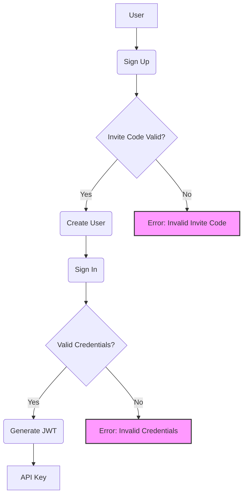

This diagram illustrates the authentication flow, starting from user sign-up to API key generation. Sources: [src/fyodorov_utils/auth/auth.py](), [src/fyodorov_utils/auth/endpoints.py]()

### Key Functions

*   **`sign_up`**: Registers a new user, verifying the invite code and creating a user account. Sources: [src/fyodorov_utils/auth/auth.py:40-76]()
*   **`sign_in`**: Authenticates an existing user and returns a JWT token. Sources: [src/fyodorov_utils/auth/auth.py:79-89]()
*   **`create_api_key`**: Generates an API key (JWT) for the authenticated user. Sources: [src/fyodorov_utils/auth/auth.py:92-95]()
*   **`authenticate`**: Validates the JWT token and retrieves user information. Sources: [src/fyodorov_utils/auth/auth.py:21-31]()

### API Endpoints

The `users_app` FastAPI application defines the following endpoints for user authentication: Sources: [src/fyodorov_utils/auth/endpoints.py]()

| Endpoint          | Method | Description                               |
| ----------------- | ------ | ----------------------------------------- |
| `/users/`         | GET    | Checks if the user is logged in           |
| `/users/sign_up`  | POST   | Registers a new user                      |
| `/users/sign_in`  | POST   | Authenticates an existing user            |
| `/users/create_api_key` | POST   | Generates an API key for the user       |

Sources: [src/fyodorov_utils/auth/endpoints.py:9-23]()

### JWT Authentication

JWTs are used to authenticate users and secure API endpoints. The `authenticate` function decodes the JWT token, verifies its signature, and extracts user information. Sources: [src/fyodorov_utils/auth/auth.py:22-30]()

```python
async def authenticate(credentials: HTTPAuthorizationCredentials = Security(security)):
    try:
        payload = jwt.decode(
            credentials.credentials,
            settings.JWT_SECRET,
            algorithms=["HS256"],
            audience="authenticated",
        )
        # Perform additional validation checks as needed (e.g., expiration, issuer, audience)
        print(f"Decoded JWT payload: {payload}")
        return payload  # Or a user object based on the payload
    except jwt.PyJWTError as e:
        print(f"JWT error: {str(e)}")
        raise HTTPException(
            status_code=HTTP_403_FORBIDDEN, detail="Could not validate credentials"
        ) from e
```

This code snippet shows how the JWT token is decoded and validated using the `jwt` library and the `JWT_SECRET` from the settings. Sources: [src/fyodorov_utils/auth/auth.py:22-30](), [src/fyodorov_utils/config/config.py]()

## Error Handling

The `fyodorov-utils` library provides a decorator for handling errors in FastAPI endpoints. The `error_handler` decorator catches exceptions, logs them, and returns a standardized error response. Sources: [src/fyodorov_utils/decorators/logging.py]()

### Error Handling Decorator

The `error_handler` decorator simplifies error handling in FastAPI endpoints by automatically catching exceptions and logging them.

```python
from fyodorov_utils.decorators.logging import error_handler

@app.post
@error_handler
def endpoint():
    return
```

This code snippet demonstrates how to use the `error_handler` decorator to handle errors in a FastAPI endpoint. Sources: [src/fyodorov_utils/decorators/logging.py:6-26]()

### Error Handling Flow

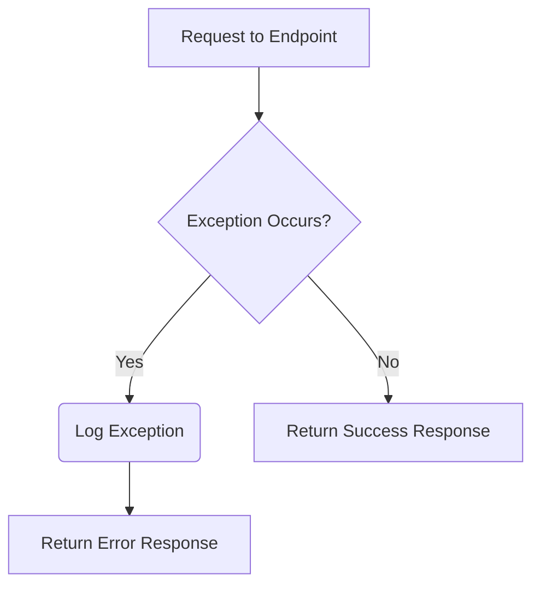

This diagram illustrates the error handling flow. If an exception occurs during the execution of an endpoint, it is logged, and an error response is returned. Otherwise, a success response is returned. Sources: [src/fyodorov_utils/decorators/logging.py]()

## Configuration Management

The configuration management component handles loading and managing configuration settings for the `fyodorov-utils` library. It uses the `pydantic-settings` library to define and validate configuration settings. Sources: [src/fyodorov_utils/config/config.py]()

### Settings Class

The `Settings` class defines the configuration settings for the `fyodorov-utils` library. It loads settings from environment variables using the `os` module and the `dotenv` library. Sources: [src/fyodorov_utils/config/config.py]()

```python
from pydantic_settings import BaseSettings
import os
from dotenv import load_dotenv

load_dotenv()


class Settings(BaseSettings):
    JWT_SECRET: str = os.getenv("JWT_SECRET")
    SUPABASE_URL: str = os.getenv("SUPABASE_PROJECT_URL")
    SUPABASE_KEY: str = os.getenv("SUPABASE_API_KEY")
```

This code snippet shows the `Settings` class, which defines the configuration settings for the `fyodorov-utils` library. It loads settings from environment variables such as `JWT_SECRET`, `SUPABASE_URL`, and `SUPABASE_API_KEY`. Sources: [src/fyodorov_utils/config/config.py:3-12]()

## YAML Parsing Service

The YAML parsing service provides functionality to create and retrieve resources (providers, models, agents, instances, tools) in YAML format. It uses FastAPI endpoints to handle requests and the `yaml` library to serialize and deserialize data. Sources: [src/fyodorov_utils/services/yaml.py]()

### YAML Endpoints

*   **`create_from_yaml`**: Creates resources from a YAML configuration file. Sources: [src/fyodorov_utils/services/yaml.py:28-91]()
*   **`get_yaml`**: Retrieves all resources in YAML format. Sources: [src/fyodorov_utils/services/yaml.py:94-123]()
*   **`get_yaml_by_name`**: Retrieves resources of a specific type in YAML format. Sources: [src/fyodorov_utils/services/yaml.py:126-169]()

### YAML Parsing Flow

```mermaid
graph TD
    A[Request to Endpoint] --> B{Valid YAML?};
    B -- Yes --> C(Parse YAML);
    C --> D(Save Resources to DB);
    D --> E[Return Success Response (YAML)];
    B -- No --> F[Return Error Response];
```

This diagram illustrates the YAML parsing flow. The service validates the YAML, parses it, saves the resources to the database, and returns a success response in YAML format. Sources: [src/fyodorov_utils/services/yaml.py]()

## Supabase Integration

The `fyodorov-utils` library integrates with Supabase for database operations and user authentication. The `get_supabase` function initializes the Supabase client with the provided access token and configuration settings. Sources: [src/fyodorov_utils/config/supabase.py]()

### Supabase Client Initialization

```python
import supabase
from fyodorov_utils.config.config import Settings

settings = Settings()

def get_supabase(access_token: str = None):
    return supabase.create_client(settings.SUPABASE_URL, settings.SUPABASE_KEY, options={"global": {"headers": {"Authorization": f"Bearer {access_token}"}}})
```

This code snippet shows how the Supabase client is initialized using the `SUPABASE_URL` and `SUPABASE_KEY` from the settings. Sources: [src/fyodorov_utils/config/supabase.py:4-9](), [src/fyodorov_utils/config/config.py]()

## Conclusion

The `fyodorov-utils` library provides essential utility functions and classes for building and managing services within the Fyodorov project. It offers robust authentication, error handling, configuration management, and YAML parsing capabilities, promoting consistency and efficiency across the ecosystem.


---

<a id='arch-auth'></a>

## Authentication Architecture

### Related Pages

Related topics: [Architecture Overview](#arch-overview), [Authentication](#features-authentication)

<details>
<summary>Relevant source files</summary>

The following files were used as context for generating this wiki page:

- [src/fyodorov_utils/auth/auth.py](src/fyodorov_utils/auth/auth.py)
- [src/fyodorov_utils/auth/endpoints.py](src/fyodorov_utils/auth/endpoints.py)
- [src/fyodorov_utils/decorators/logging.py](src/fyodorov_utils/decorators/logging.py)
- [src/fyodorov_utils/config/config.py](src/fyodorov_utils/config/config.py)
- [src/fyodorov_utils/config/supabase.py](src/fyodorov_utils/config/supabase.py)
- [README.md](README.md)
</details>

# Authentication Architecture

The `fyodorov_utils` library provides authentication utilities for securing services, including user signup, sign-in, API key creation, and JWT-based authentication. It leverages Supabase for user management and JWT for secure communication. The authentication mechanisms ensure that only authorized users can access protected resources and functionalities.  The library also includes a decorator for handling errors in FastAPI endpoints. [README.md]()

## Authentication Flow

The authentication process relies on JWT (JSON Web Tokens) for verifying user identity. The `authenticate` function decodes the JWT from the request header and validates it against a secret key. If the token is valid, the function returns the payload, which can be used to identify the user.  The `users_app` FastAPI application provides endpoints for user signup, sign-in, and API key creation. [src/fyodorov_utils/auth/auth.py](), [src/fyodorov_utils/auth/endpoints.py]()

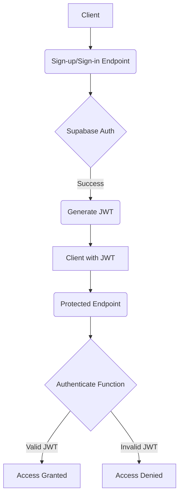

This diagram illustrates the general flow of authentication, from user registration/login to accessing protected resources using a JWT.  Sources: [src/fyodorov_utils/auth/auth.py](), [src/fyodorov_utils/auth/endpoints.py]()

## Key Components

### JWT Authentication

The `authenticate` function is a key component of the authentication architecture. It's used as a dependency in FastAPI endpoints to ensure that only authenticated users can access them.  It retrieves the JWT from the `Authorization` header, decodes it, and validates it. If the JWT is invalid, it raises an `HTTPException` with a 403 Forbidden status code. [src/fyodorov_utils/auth/auth.py:20-31]()

```python
from fastapi import Depends, HTTPException, Security
from fastapi.security import HTTPBearer, HTTPAuthorizationCredentials
import jwt
from starlette.status import HTTP_403_FORBIDDEN

async def authenticate(credentials: HTTPAuthorizationCredentials = Security(security)):
    try:
        payload = jwt.decode(
            credentials.credentials,
            settings.JWT_SECRET,
            algorithms=["HS256"],
            audience="authenticated",
        )
        print(f"Decoded JWT payload: {payload}")
        return payload
    except jwt.PyJWTError as e:
        print(f"JWT error: {str(e)}")
        raise HTTPException(
            status_code=HTTP_403_FORBIDDEN, detail="Could not validate credentials"
        ) from e
```
This code snippet shows the `authenticate` function, which validates the JWT token. Sources: [src/fyodorov_utils/auth/auth.py:20-31](), [src/fyodorov_utils/config/config.py]()

### User Endpoints

The `endpoints.py` file defines FastAPI endpoints for user signup, sign-in, and API key creation. These endpoints use the functions defined in `auth.py` to handle the actual authentication logic. [src/fyodorov_utils/auth/endpoints.py]()

```python
from fastapi import FastAPI, Body, Depends
from .auth import sign_up, sign_in, create_api_key, authenticate

users_app = FastAPI(
    title="Fyodorov-Auth",
    description="Common auth endpoints for Fyodorov services",
    version="0.0.1",
)

@users_app.post("/sign_up")
async def sign_up_endpoint(
    email: str = Body(...), password: str = Body(...), invite_code: str = Body(...)
):
    return await sign_up(email, password, invite_code)

@users_app.post("/sign_in")
async def sign_in_endpoint(email: str = Body(...), password: str = Body(...)):
    return await sign_in(email, password)

@users_app.post("/create_api_key")
async def create_api_key_endpoint(expiration: int = 15, user=Depends(authenticate)):
    return await create_api_key(expiration, user)
```

This code snippet shows the user endpoints defined in `endpoints.py`.  Sources: [src/fyodorov_utils/auth/endpoints.py]()

### Supabase Integration

The authentication system uses Supabase for user management. The `sign_up` and `sign_in` functions interact with the Supabase Auth API to create and authenticate users.  The `get_supabase` function in `supabase.py` is used to create a Supabase client. [src/fyodorov_utils/auth/auth.py](), [src/fyodorov_utils/config/supabase.py]()

```python
from supabase import create_client, Client
from supabase.lib.client_options import ClientOptions
from .config import Settings

settings = Settings()

def get_supabase(jwt: str = None) -> Client:
    if jwt and jwt != "" and len(jwt.split(".")) == 3:
        return create_client(
            settings.SUPABASE_URL,
            settings.SUPABASE_KEY,
            options=ClientOptions(headers={"Authorization": f"Bearer {jwt}"}),
        )
    else:
        return create_client(settings.SUPABASE_URL, settings.SUPABASE_KEY)
```

This code snippet shows the `get_supabase` function, which creates a Supabase client. Sources: [src/fyodorov_utils/config/supabase.py:4-17](), [src/fyodorov_utils/config/config.py]()

### API Key Generation

The `create_api_key` endpoint generates a JWT that can be used as an API key.  The `generate_jwt` function creates the JWT with a specified expiration time. [src/fyodorov_utils/auth/auth.py:75-88](), [src/fyodorov_utils/auth/endpoints.py]()

```python
@error_handler
async def create_api_key(expiration: int = 15, user=Depends(authenticate)):
    print(f"[create_api_key] expiration: {expiration}")
    api_key = generate_jwt(user, expiration)
    return {"message": "API key created successfully", "api_key": api_key}

def generate_jwt(user, days_to_expiry: int = 30) -> str:
    if days_to_expiry > 90 or days_to_expiry < 1:
        days_to_expiry = 30
    user["iat"] = datetime.utcnow()
    expiry = datetime.utcnow() + timedelta(days=days_to_expiry)
    print(f"Expiry: {expiry} \nNow: {datetime.utcnow()}")
    user["exp"] = expiry
    token = jwt.encode(user, settings.JWT_SECRET, algorithm="HS256")
    return token
```

This code snippet shows the `create_api_key` endpoint and the `generate_jwt` function.  Sources: [src/fyodorov_utils/auth/auth.py:75-88](), [src/fyodorov_utils/auth/endpoints.py]()

### Error Handling

The `@error_handler` decorator is used to handle exceptions in the authentication functions and FastAPI endpoints. It logs the error and raises an `HTTPException` with a 400 status code. [src/fyodorov_utils/decorators/logging.py]()

```python
from functools import wraps
from fastapi import HTTPException
import asyncio

def error_handler(f):
    @wraps(f)
    async def wrapper(*args, **kwargs):
        try:
            if asyncio.iscoroutinefunction(f):
                return await f(*args, **kwargs)
            else:
                return f(*args, **kwargs)
        except HTTPException as http_exc:
            print(f"{f.__name__} - HTTP Exception: {http_exc.detail}")
            raise
        except Exception as exc:
            print(f"{f.__name__} - Unhandled Exception: {exc}")
            raise HTTPException(status_code=400, detail="An error occurred")

    return wrapper
```

This code snippet shows the `error_handler` decorator.  Sources: [src/fyodorov_utils/decorators/logging.py:3-22]()

## Data Structures

### Settings

The `Settings` class, defined in `config.py`, manages configuration settings such as the JWT secret, Supabase URL, and Supabase API key. It uses `pydantic_settings` and environment variables for configuration. [src/fyodorov_utils/config/config.py]()

```python
from pydantic_settings import BaseSettings
import os
from dotenv import load_dotenv

load_dotenv()

class Settings(BaseSettings):
    JWT_SECRET: str = os.getenv("JWT_SECRET")
    SUPABASE_URL: str = os.getenv("SUPABASE_PROJECT_URL")
    SUPABASE_KEY: str = os.getenv("SUPABASE_API_KEY")
```

This code snippet shows the `Settings` class. Sources: [src/fyodorov_utils/config/config.py:3-12]()

### Invite Codes

The `sign_up` function checks for a valid invite code in the `invite_codes` table in Supabase before creating a new user.  This ensures that only invited users can register. [src/fyodorov_utils/auth/auth.py]()

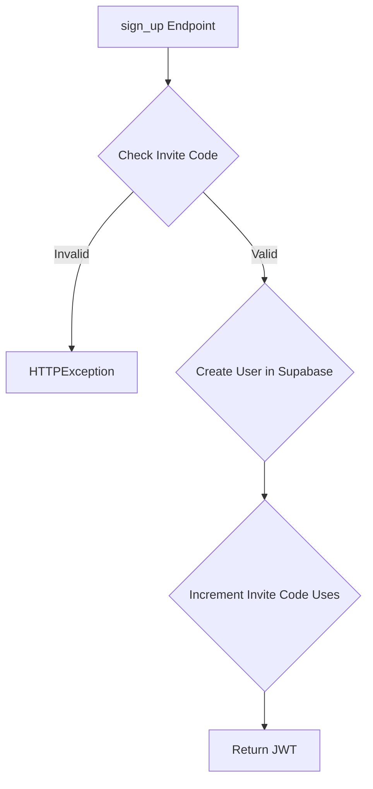

This diagram illustrates the invite code validation process during user sign-up. Sources: [src/fyodorov_utils/auth/auth.py]()

## Authentication Helper Usage

The `authenticate` function can be used as a dependency in FastAPI endpoints to protect them. The following code snippet shows how to use the `authenticate` function. [README.md]()

```python
from fyodorov_utils.auth.auth import authenticate

@app.post('/endpoint')
@error_handler
def create_provider(provider: ProviderModel, user = Depends(authenticate)):
    return
```

This code snippet shows how to use the `authenticate` function as a dependency in a FastAPI endpoint. Sources: [README.md]()

## Conclusion

The `fyodorov_utils` library provides a comprehensive authentication architecture for securing services. It leverages JWT for authentication, Supabase for user management, and a decorator for error handling. The library provides endpoints for user signup, sign-in, and API key creation. The authentication mechanisms ensure that only authorized users can access protected resources and functionalities.


---

<a id='features-error-handling'></a>

## Error Handling

### Related Pages

Related topics: [Architecture Overview](#arch-overview)

<details>
<summary>Relevant source files</summary>

The following files were used as context for generating this wiki page:

- [src/fyodorov_utils/decorators/logging.py](src/fyodorov_utils/decorators/logging.py)
- [src/fyodorov_utils/auth/auth.py](src/fyodorov_utils/auth/auth.py)
- [src/fyodorov_utils/services/yaml.py](src/fyodorov_utils/services/yaml.py)
- [src/fyodorov_utils/auth/endpoints.py](src/fyodorov_utils/auth/endpoints.py)
- [src/fyodorov_utils/services/tool.py](src/fyodorov_utils/services/tool.py)
- [src/fyodorov_utils/services/base.py](src/fyodorov_utils/services/base.py)
</details>

# Error Handling

Error handling in `fyodorov-utils` is implemented using a decorator that wraps FastAPI endpoints to catch and log exceptions in a consistent manner. This approach ensures that errors are handled uniformly across different services within the Fyodorov project. The error handler logs the exception and raises an `HTTPException` with a default status code of 400 and a generic error message. [Authentication](#authentication) is also part of error handling.

## Error Handler Decorator

The `error_handler` decorator is defined in `fyodorov_utils/decorators/logging.py`. It's used to wrap FastAPI endpoint functions. When an exception occurs within the wrapped function, the decorator catches it, logs the error, and raises an `HTTPException`. This ensures that errors are handled consistently across the application. Sources: [src/fyodorov_utils/decorators/logging.py:4-20]()

```python
from functools import wraps
from fastapi import HTTPException
import asyncio


def error_handler(f):
    @wraps(f)
    async def wrapper(*args, **kwargs):
        try:
            # Use 'await' for async functions
            if asyncio.iscoroutinefunction(f):
                return await f(*args, **kwargs)
            else:
                return f(*args, **kwargs)
        except HTTPException as http_exc:
            print(f"{f.__name__} - HTTP Exception: {http_exc.detail}")
            raise
        except Exception as exc:
            print(f"{f.__name__} - Unhandled Exception: {exc}")
            raise HTTPException(status_code=400, detail="An error occurred")

    return wrapper
```
Sources: [src/fyodorov_utils/decorators/logging.py:1-20]()

### Usage

To use the `error_handler` decorator, simply apply it to a FastAPI endpoint function using the `@error_handler` syntax. The decorator will automatically catch any `HTTPException` or generic `Exception` raised within the function. Sources: [src/fyodorov_utils/decorators/logging.py:23-29]()

```python
from fyodorov_utils.decorators.logging import error_handler

@app.post
@error_handler
def endpoint():
    return
```
Sources: [README.md]()

### Error Logging

The `error_handler` decorator logs both `HTTPException` and generic `Exception` types. For `HTTPException`, it logs the detail message. For generic `Exception`, it logs the exception message. This logging helps in debugging and monitoring the application. Sources: [src/fyodorov_utils/decorators/logging.py:14-17]()

### Exception Handling Flow

The following diagram illustrates the flow of exception handling using the `error_handler` decorator:

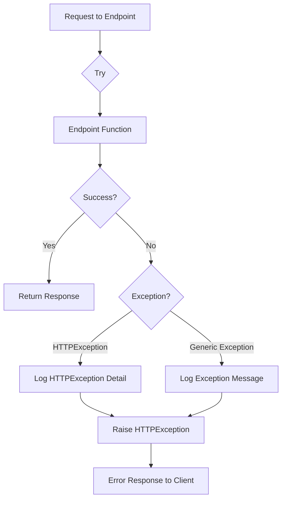
Sources: [src/fyodorov_utils/decorators/logging.py:4-17]()

## Authentication

Authentication is handled by the `authenticate` function in `fyodorov_utils/auth/auth.py`. It verifies the user's JWT token and makes the user object available within the function for additional authorization logic. If authentication fails, an `HTTPException` with a 403 status code is raised. Sources: [src/fyodorov_utils/auth/auth.py:31-43](), [README.md]()

```python
from fastapi import Depends, HTTPException, Security, Body
from fastapi.security import HTTPBearer, HTTPAuthorizationCredentials
import jwt
from starlette.status import HTTP_403_FORBIDDEN
import gotrue
from datetime import datetime, timedelta
from fyodorov_utils.decorators.logging import error_handler
from fyodorov_utils.config.config import Settings
from fyodorov_utils.config.supabase import get_supabase

settings = Settings()
security = HTTPBearer()
supabase = get_supabase()


async def authenticate(credentials: HTTPAuthorizationCredentials = Security(security)):
    try:
        payload = jwt.decode(
            credentials.credentials,
            settings.JWT_SECRET,
            algorithms=["HS256"],
            audience="authenticated",
        )
        # Perform additional validation checks as needed (e.g., expiration, issuer, audience)
        print(f"Decoded JWT payload: {payload}")
        return payload  # Or a user object based on the payload
    except jwt.PyJWTError as e:
        print(f"JWT error: {str(e)}")
        raise HTTPException(
            status_code=HTTP_403_FORBIDDEN, detail="Could not validate credentials"
        ) from e
```
Sources: [src/fyodorov_utils/auth/auth.py:1-43]()

### Authentication Flow

The following sequence diagram illustrates the authentication flow:

```mermaid
sequenceDiagram
    participant Client
    participant API Endpoint
    participant authenticate Function
    participant JWT
    
    Client->>API Endpoint: Request with JWT
    activate API Endpoint
    API Endpoint->>+authenticate Function: Depends(authenticate)
    activate authenticate Function
    authenticate Function->>JWT: decode(JWT_SECRET)
    activate JWT
    alt JWT Valid
        JWT-->>-authenticate Function: Payload
        deactivate JWT
        authenticate Function-->>-API Endpoint: User Object
        deactivate authenticate Function
        API Endpoint->>Client: Response
        deactivate API Endpoint
    else JWT Invalid
        JWT--xauthenticate Function: JWT Error
        deactivate JWT
        authenticate Function-->>-API Endpoint: HTTPException (403)
        deactivate authenticate Function
        API Endpoint->>Client: Error Response (403)
        deactivate API Endpoint
    end
```
Sources: [src/fyodorov_utils/auth/auth.py:31-43]()

### User Authentication Endpoints

The `fyodorov-utils` library provides shared user endpoints for signing up, logging in, and creating API keys. These endpoints are defined in `fyodorov_utils/auth/endpoints.py` and can be mounted in a FastAPI application. Error handling is applied to these endpoints using the `error_handler` decorator. Sources: [src/fyodorov_utils/auth/endpoints.py](), [README.md]()

```python
# User endpoints
from fyodorov_utils.auth.endpoints import users_app
app.mount('/users', users_app)
```
Sources: [README.md]()

### Sign-up Error Handling

The `sign_up` function in `fyodorov_utils/auth/auth.py` handles user registration. It checks if the invite code is valid and increments the number of uses. If the invite code is invalid or has reached the maximum usage, an `HTTPException` with a 401 status code is raised. Sources: [src/fyodorov_utils/auth/auth.py:46-62]()

```python
@error_handler
async def sign_up(
    email: str = Body(...), password: str = Body(...), invite_code: str = Body(...)
):
    # Check if invite code exists
    invite_code_check = (
        supabase.from_("invite_codes")
        .select("nr_uses, max_uses")
        .eq("code", invite_code)
        .execute()
    )
    if not invite_code_check.data:
        raise HTTPException(status_code=401, detail="Invalid invite code")

    invite_code_data = invite_code_check.data[0]
    nr_uses = invite_code_data["nr_uses"]
    max_uses = invite_code_data["max_uses"]

    if nr_uses >= max_uses:
        raise HTTPException(
            status_code=401, detail="Invite code has reached maximum usage"
        )
```
Sources: [src/fyodorov_utils/auth/auth.py:45-62]()

### Sign-in Error Handling

The `sign_in` function in `fyodorov_utils/auth/auth.py` handles user authentication. If the provided email and password are not valid, an `HTTPException` with a 401 status code is raised. Sources: [src/fyodorov_utils/auth/auth.py:78-85]()

```python
@error_handler
async def sign_in(email: str = Body(...), password: str = Body(...)):
    try:
        user = supabase.auth.sign_in_with_password(
            {
                "email": email,
                "password": password,
            }
        )
    except gotrue.errors.AuthApiError as e:
        print(f"Error signing in - invalid credentials: {type(e)} {str(e)}")
        raise HTTPException(status_code=401, detail="Invalid credentials")
    except Exception as e:
        print(f"Error signing in: {type(e)} {str(e)}")
        raise HTTPException(status_code=401, detail="Error signing in")
    return {"message": "User signed in successfully", "jwt": user.session.access_token}
```
Sources: [src/fyodorov_utils/auth/auth.py:77-85]()

## YAML Parsing Error Handling

The `fyodorov_utils/services/yaml.py` file contains endpoints for parsing and retrieving YAML configurations. These endpoints use the `error_handler` decorator to handle exceptions that may occur during YAML parsing or database operations. Sources: [src/fyodorov_utils/services/yaml.py]()

### `create_from_yaml` Endpoint

The `create_from_yaml` endpoint parses a YAML configuration from the request body and saves the resources defined in the configuration to the database. If the YAML format is invalid, an `HTTPException` with a 400 status code is raised. Sources: [src/fyodorov_utils/services/yaml.py:27-65]()

```python
@app.post("/")
@error_handler
async def create_from_yaml(request: Request, user=Depends(authenticate)):
    try:
        fyodorov_yaml = await request.body()
        print(f"fyodorov_yaml: \n{fyodorov_yaml}")
        fyodorov_config = yaml.safe_load(fyodorov_yaml)
        print(f"fyodorov_config: \n{fyodorov_config}")
        response = {
            "providers": [],
            "models": [],
            "agents": [],
            "instances": [],
            "tools": [],
        }
        print(f"fyodorov_config: \n{fyodorov_config}")
        if "providers" in fyodorov_config:
            print("Saving providers")
            for provider_dict in fyodorov_config["providers"]:
                print(f"Provider: {provider_dict}")
                provider = ProviderModel.from_dict(provider_dict)
                new_provider = await Provider.save_provider_in_db(
                    user["session_id"], provider, user["sub"]
                )
                response["providers"].append(new_provider)
        print("Saved providers", response["providers"])
        if "models" in fyodorov_config:
            for model_dict in fyodorov_config["models"]:
                model = LLMModel.from_dict(model_dict)
                print(f"Model: {model}")
                new_model = await LLM.save_model_in_db(
                    user["session_id"], user["sub"], model
                )
                response["models"].append(new_model)
        print("Saved models", response["models"])
        if "tools" in fyodorov_config:
            for tool_dict in fyodorov_config["tools"]:
                print(f"Tool dict: {tool_dict}")
                # marshal back to yaml
                tool_yaml = yaml.dump(tool_dict)
                tool_instance = ToolModel.parse_raw(tool_yaml)
                tool_instance.user_id = user["sub"]
                tool_instance = await Tool.create_in_db(
                    user["session_id"], tool_instance
                )
                print(f"Saved tool: {tool_instance}")
                    response["tools"].append(tool_instance.to_dict())
        print("Saved tools", response["tools"])
        if "agents" in fyodorov_config:
            for agent_dict in fyodorov_config["agents"]:
                new_agent = await Agent.save_from_dict(
                    user["session_id"], user["sub"], agent_dict
                )
                response["agents"].append(new_agent)
        print("Saved agents", response["agents"])
        if len(response["agents"]) > 0:
            for agent in response["agents"]:
                instance = InstanceModel(
                    agent_id=str(agent["id"]), title=f"Default Instance {agent['id']}"
                )
                new_instance = await Instance.create_in_db(instance)
                response["instances"].append(new_instance)
        print("Saved instances", response["instances"])
        return response
    except Exception as e:
        print("Error parsing config from yaml", str(e))
        raise HTTPException(status_code=400, detail="Invalid YAML format")
```
Sources: [src/fyodorov_utils/services/yaml.py:27-65]()

### `get_yaml_by_name` Endpoint

The `get_yaml_by_name` endpoint retrieves resources of a specific type (e.g., providers, models, agents) and returns them in YAML format. If the resource type is invalid or an error occurs during database retrieval, an `HTTPException` with a 400 status code is raised. Sources: [src/fyodorov_utils/services/yaml.py:68-108]()

### `get_yaml` Endpoint

The `get_yaml` endpoint retrieves all resources (providers, models, agents, instances, and tools) and returns them in YAML format. If an error occurs during database retrieval, an `HTTPException` with a 400 status code is raised. Sources: [src/fyodorov_utils/services/yaml.py:111-134]()

## Tool Service Error Handling

The `fyodorov_utils/services/tool.py` file defines the `Tool` service, which provides methods for creating, updating, deleting, and retrieving tools from the database. These methods include error handling to catch exceptions that may occur during database operations. Sources: [src/fyodorov_utils/services/tool.py]()

### Database Operation Error Handling

The `Tool` service methods, such as `create_in_db`, `update_in_db`, `delete_in_db`, `get_in_db`, and `get_all_in_db`, include try-except blocks to catch exceptions that may occur during database operations. If an exception occurs, it is logged, and the exception is re-raised. Sources: [src/fyodorov_utils/services/tool.py:15-74]()

## Base Service Error Handling

The `fyodorov_utils/services/base.py` file defines a base class `Base` with methods for creating and updating objects in the database. These methods include error handling to catch exceptions that may occur during database operations. Sources: [src/fyodorov_utils/services/base.py]()

### Database Operation Error Handling

The `Base` class methods, such as `create_in_db` and `update_in_db`, include try-except blocks to catch exceptions that may occur during database operations. If an exception occurs, it is logged, and the exception is re-raised. Sources: [src/fyodorov_utils/services/base.py:26-42]()

## Summary

Error handling in `fyodorov-utils` is implemented using a decorator-based approach, ensuring consistent error handling across FastAPI endpoints. The `error_handler` decorator catches exceptions, logs errors, and raises `HTTPException` to provide informative error responses to clients. Authentication and YAML parsing functionalities also incorporate error handling to ensure the reliability and stability of the system.


---

<a id='features-authentication'></a>

## Authentication

### Related Pages

Related topics: [Authentication Architecture](#arch-auth)

<details>
<summary>Relevant source files</summary>

The following files were used as context for generating this wiki page:

- [src/fyodorov_utils/auth/auth.py](src/fyodorov_utils/auth/auth.py)
- [src/fyodorov_utils/auth/endpoints.py](src/fyodorov_utils/auth/endpoints.py)
- [src/fyodorov_utils/config/config.py](src/fyodorov_utils/config/config.py)
- [src/fyodorov_utils/decorators/logging.py](src/fyodorov_utils/decorators/logging.py)
- [src/fyodorov_utils/config/supabase.py](src/fyodorov_utils/config/supabase.py)
- [README.md](README.md)
</details>

# Authentication

The `fyodorov-utils` library provides authentication functionalities for securing services within the Fyodorov project. This includes user sign-up, sign-in, API key creation, and authentication middleware to protect API endpoints. The authentication process relies on JWT (JSON Web Tokens) and Supabase for user management. [Shared User Endpoints](#shared-user-endpoints) are also provided as a part of the library. Sources: [README.md]()

## Authentication Flow

The authentication flow involves verifying user credentials and issuing JWTs for authenticated users. These JWTs are then used to authorize access to protected resources.

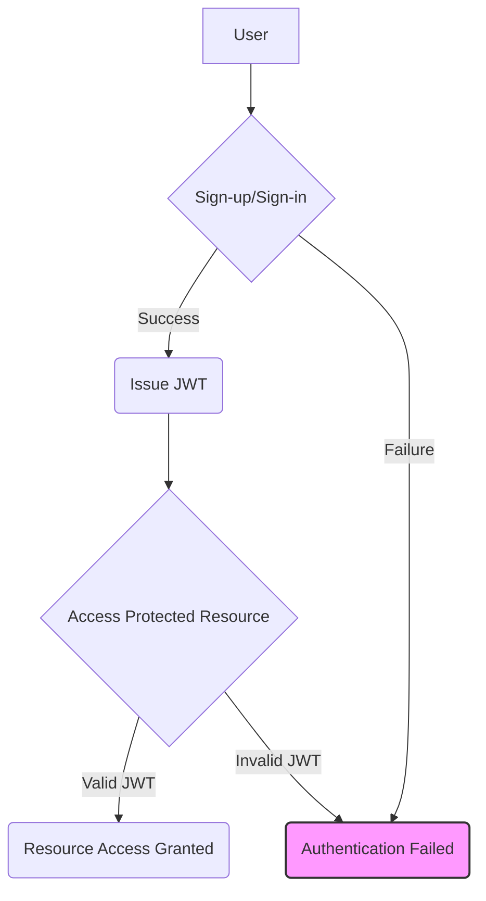

This diagram illustrates the general flow of authentication, from user interaction to resource access. Sources: [src/fyodorov_utils/auth/auth.py](), [src/fyodorov_utils/auth/endpoints.py]()

## Components

The authentication system consists of several key components:

*   **`authenticate`**: A dependency that authenticates users based on JWT credentials provided in the `Authorization` header. Sources: [src/fyodorov_utils/auth/auth.py]()
*   **`sign_up`**: Function to register new users, verifying invite codes and storing user data in Supabase. Sources: [src/fyodorov_utils/auth/auth.py]()
*   **`sign_in`**: Function to authenticate existing users and return a JWT upon successful authentication. Sources: [src/fyodorov_utils/auth/auth.py]()
*   **`create_api_key`**: Function to generate API keys (JWTs) for authenticated users, with configurable expiration times. Sources: [src/fyodorov_utils/auth/auth.py]()
*   **`users_app`**: FastAPI application instance containing the authentication endpoints. Sources: [src/fyodorov_utils/auth/endpoints.py]()

## JWT Authentication

JWTs are used to verify the identity of users accessing protected resources. The `authenticate` function decodes the JWT, validates it against a secret key, and returns the payload if the token is valid. Sources: [src/fyodorov_utils/auth/auth.py]()

```python
async def authenticate(credentials: HTTPAuthorizationCredentials = Security(security)):
    try:
        payload = jwt.decode(
            credentials.credentials,
            settings.JWT_SECRET,
            algorithms=["HS256"],
            audience="authenticated",
        )
        # Perform additional validation checks as needed (e.g., expiration, issuer, audience)
        print(f"Decoded JWT payload: {payload}")
        return payload  # Or a user object based on the payload
    except jwt.PyJWTError as e:
        print(f"JWT error: {str(e)}")
        raise HTTPException(
            status_code=HTTP_403_FORBIDDEN, detail="Could not validate credentials"
        ) from e
```

This code snippet shows how the `authenticate` function decodes and validates the JWT. Sources: [src/fyodorov_utils/auth/auth.py:16-31]()

The `JWT_SECRET` is retrieved from the environment variables using `pydantic_settings`. Sources: [src/fyodorov_utils/config/config.py]()

## User Sign-up

The `sign_up` function handles user registration. It checks the validity of an invite code, creates a new user in Supabase, and increments the usage count of the invite code. Sources: [src/fyodorov_utils/auth/auth.py]()

```python
async def sign_up(
    email: str = Body(...), password: str = Body(...), invite_code: str = Body(...)
):
    # Check if invite code exists
    invite_code_check = (
        supabase.from_("invite_codes")
        .select("nr_uses, max_uses")
        .eq("code", invite_code)
        .execute()
    )
    if not invite_code_check.data:
        raise HTTPException(status_code=401, detail="Invalid invite code")

    invite_code_data = invite_code_check.data[0]
    nr_uses = invite_code_data["nr_uses"]
    max_uses = invite_code_data["max_uses"]

    if nr_uses >= max_uses:
        raise HTTPException(
            status_code=401, detail="Invite code has reached maximum usage"
        )

    user = supabase.auth.sign_up(
        {
            "email": email,
            "password": password,
            "options": {
                "data": {
                    "invite_code": invite_code,
                }
            },
        }
    )
    # Increment nr_uses in invite_codes table
    nr_uses += 1
    res = (
        supabase.from_("invite_codes")
        .update({"nr_uses": nr_uses})
        .eq("code", invite_code)
        .execute()
    )
    print(f"response when updating invite code nr uses: {res}")

    return {"message": "User created successfully", "jwt": user.session.access_token}
```

This snippet shows the sign-up process, including invite code validation and user creation in Supabase. Sources: [src/fyodorov_utils/auth/auth.py:36-76]()

## User Sign-in

The `sign_in` function authenticates existing users using their email and password. Upon successful authentication, it returns a JWT. Sources: [src/fyodorov_utils/auth/auth.py]()

```python
async def sign_in(email: str = Body(...), password: str = Body(...)):
    try:
        user = supabase.auth.sign_in_with_password(
            {
                "email": email,
                "password": password,
            }
        )
    except gotrue.errors.AuthApiError as e:
        print(f"Error signing in - invalid credentials: {type(e)} {str(e)}")
        raise HTTPException(status_code=401, detail="Invalid credentials")
    except Exception as e:
        print(f"Error signing in: {type(e)} {str(e)}")
        raise HTTPException(status_code=401, detail="Error signing in")
    return {"message": "User signed in successfully", "jwt": user.session.access_token}
```

This code snippet shows the sign-in process using Supabase's `sign_in_with_password` method. Sources: [src/fyodorov_utils/auth/auth.py:80-93]()

## API Key Creation

The `create_api_key` function generates a JWT that can be used as an API key. The expiration time of the API key can be configured. Sources: [src/fyodorov_utils/auth/auth.py]()

```python
async def create_api_key(expiration: int = 15, user=Depends(authenticate)):
    print(f"[create_api_key] expiration: {expiration}")
    api_key = generate_jwt(user, expiration)
    return {"message": "API key created successfully", "api_key": api_key}
```

This snippet shows the API key creation endpoint, which calls the `generate_jwt` function. Sources: [src/fyodorov_utils/auth/auth.py:97-101]()

```python
def generate_jwt(user, days_to_expiry: int = 30) -> str:
    if days_to_expiry > 90 or days_to_expiry < 1:
        days_to_expiry = 30
    user["iat"] = datetime.utcnow()
    expiry = datetime.utcnow() + timedelta(days=days_to_expiry)
    print(f"Expiry: {expiry} \nNow: {datetime.utcnow()}")
    user["exp"] = expiry
    token = jwt.encode(user, settings.JWT_SECRET, algorithm="HS256")
    return token
```

This code shows how a JWT is generated with an expiration time. Sources: [src/fyodorov_utils/auth/auth.py:103-114]()

## Shared User Endpoints

The `users_app` FastAPI instance exposes the authentication endpoints. These endpoints can be mounted in other services to provide a consistent authentication interface. Sources: [src/fyodorov_utils/auth/endpoints.py](), [README.md]()

```python
# User endpoints
from fyodorov_utils.auth.endpoints import users_app
app.mount('/users', users_app)
```

This code snippet shows how to mount the `users_app` in another FastAPI application. Sources: [README.md]()

The available endpoints are:

*   `/`: Root endpoint, requires authentication. Sources: [src/fyodorov_utils/auth/endpoints.py]()
*   `/sign_up`: User sign-up endpoint. Sources: [src/fyodorov_utils/auth/endpoints.py]()
*   `/sign_in`: User sign-in endpoint. Sources: [src/fyodorov_utils/auth/endpoints.py]()
*   `/create_api_key`: API key creation endpoint, requires authentication. Sources: [src/fyodorov_utils/auth/endpoints.py]()

## Error Handling

The `@error_handler` decorator is used to handle exceptions in the authentication functions. It logs the error and raises an `HTTPException` with a generic error message. Sources: [src/fyodorov_utils/decorators/logging.py]()

```python
from fyodorov_utils.decorators.logging import error_handler

@app.post
@error_handler
def endpoint():
    return
```

This code shows how to use the `error_handler` decorator. Sources: [README.md]()

## Supabase Configuration

Supabase is used as the backend for user management and authentication. The `get_supabase` function returns a Supabase client instance, configured with the project URL and API key. Sources: [src/fyodorov_utils/config/supabase.py]()

```python
def get_supabase(jwt: str = None) -> Client:
    if jwt and jwt != "" and len(jwt.split(".")) == 3:
        return create_client(
            settings.SUPABASE_URL,
            settings.SUPABASE_KEY,
            options=ClientOptions(headers={"Authorization": f"Bearer {jwt}"}),
        )
    else:
        return create_client(settings.SUPABASE_URL, settings.SUPABASE_KEY)
```

This snippet shows how the Supabase client is initialized, optionally with a JWT for row-level security. Sources: [src/fyodorov_utils/config/supabase.py:7-17]()

## Configuration

The following configuration parameters are used by the authentication system:

| Parameter      | Description                               | Source                                  |
| -------------- | ----------------------------------------- | --------------------------------------- |
| `JWT_SECRET`   | Secret key used to sign and verify JWTs | [src/fyodorov_utils/config/config.py]() |
| `SUPABASE_URL` | URL of the Supabase project               | [src/fyodorov_utils/config/config.py]() |
| `SUPABASE_KEY` | API key for the Supabase project          | [src/fyodorov_utils/config/config.py]() |

These parameters are loaded from environment variables using `pydantic_settings`. Sources: [src/fyodorov_utils/config/config.py]()

## Conclusion

The authentication system in `fyodorov-utils` provides a comprehensive solution for securing Fyodorov services. It includes user sign-up, sign-in, API key creation, and authentication middleware, all built on top of JWTs and Supabase. The system is designed to be modular and reusable, allowing it to be easily integrated into other services within the Fyodorov project.


---

<a id='features-yaml-parsing'></a>

## YAML Parsing

<details>
<summary>Relevant source files</summary>

The following files were used as context for generating this wiki page:

- [src/fyodorov_utils/services/yaml.py](src/fyodorov_utils/services/yaml.py)
- [src/fyodorov_utils/auth/auth.py](src/fyodorov_utils/auth/auth.py)
- [src/fyodorov_utils/decorators/logging.py](src/fyodorov_utils/decorators/logging.py)
- [src/fyodorov_utils/config/config.py](src/fyodorov_utils/config/config.py)
- [src/fyodorov_utils/auth/endpoints.py](src/fyodorov_utils/auth/endpoints.py)
- [src/fyodorov_utils/config/supabase.py](src/fyodorov_utils/config/supabase.py)
</details>

# YAML Parsing

This page details the YAML parsing functionality within the Fyodorov Utils project. It covers how the application uses YAML for configuration and data handling, including creating resources from YAML configurations and retrieving resources in YAML format. The primary focus is on the API endpoints and functions responsible for parsing and generating YAML data, and the error handling mechanisms in place.

## YAML Endpoints

The `src/fyodorov_utils/services/yaml.py` file defines two main API endpoints for handling YAML data: a `POST` endpoint for creating resources from a YAML configuration and a `GET` endpoint for retrieving resources as YAML. These endpoints use FastAPI and the `yaml` library to parse and serialize YAML data. Sources: [src/fyodorov_utils/services/yaml.py]()

### Create Resources from YAML (POST)

The `create_from_yaml` endpoint handles `POST` requests to create resources from a YAML configuration file. It uses the `yaml.safe_load` function to parse the YAML content from the request body. It then iterates through the parsed configuration to create providers, models, tools and agents. Instances are created automatically for agents. The endpoint returns a dictionary containing lists of created resources. Sources: [src/fyodorov_utils/services/yaml.py:33-95]()

```python
@app.post("/")
@error_handler
async def create_from_yaml(request: Request, user=Depends(authenticate)):
    try:
        fyodorov_yaml = await request.body()
        print(f"fyodorov_yaml: \n{fyodorov_yaml}")
        fyodorov_config = yaml.safe_load(fyodorov_yaml)
        print(f"fyodorov_config: \n{fyodorov_config}")
        response = {
            "providers": [],
            "models": [],
            "agents": [],
            "instances": [],
            "tools": [],
        }
        print(f"fyodorov_config: \n{fyodorov_config}")
        if "providers" in fyodorov_config:
            print("Saving providers")
            for provider_dict in fyodorov_config["providers"]:
                print(f"Provider: {provider_dict}")
                provider = ProviderModel.from_dict(provider_dict)
                new_provider = await Provider.save_provider_in_db(
                    user["session_id"], provider, user["sub"]
                )
```
Sources: [src/fyodorov_utils/services/yaml.py:33-52]()

### Retrieve Resources as YAML (GET)

The `get_yaml` endpoint handles `GET` requests to retrieve all resources as a YAML file. It fetches providers, models, agents, instances, and tools from the database and serializes them into a YAML format using `yaml.dump`. The response is returned with the `application/x-yaml` media type. Sources: [src/fyodorov_utils/services/yaml.py:97-125]()

```python
@app.get("/")
@error_handler
async def get_yaml(user=Depends(authenticate)):
    try:
        limit = 100
        result = {
            "providers": [],
            "models": [],
            "agents": [],
            "instances": [],
            "tools": [],
        }
        providers = await Provider.get_providers(limit=limit, user_id=user["sub"])
        result["providers"] = [provider.resource_dict() for provider in providers]
        models = await LLM.get_models(limit=limit, user_id=user["sub"])
        result["models"] = [model.resource_dict() for model in models]
        agents = await Agent.get_all_in_db(limit=limit, user_id=user["sub"])
        result["agents"] = [agent.resource_dict() for agent in agents]
        instances = await Instance.get_all_in_db(limit=limit, user_id=user["sub"])
        result["instances"] = [instance.resource_dict() for instance in instances]
        tools = await Tool.get_all_in_db(limit=limit, user_id=user["sub"])
        result["tools"] = [tool.resource_dict() for tool in tools]
        print(f"Result: {result}")
        yaml_result = yaml.dump(result, indent=2)
        print(f"YAML: {yaml_result}")
        return Response(content=yaml_result, media_type="application/x-yaml")
```
Sources: [src/fyodorov_utils/services/yaml.py:97-122]()

### Retrieve Resources by Type as YAML (GET /{resource_type})

The `get_yaml_by_name` endpoint handles `GET` requests to retrieve specific resource types as a YAML file. It fetches providers, models, agents, instances, or tools from the database based on the `resource_type` parameter and serializes them into a YAML format using `yaml.dump`. The response is returned with the `application/x-yaml` media type. Sources: [src/fyodorov_utils/services/yaml.py:130-166]()

```python
@app.get("/{resource_type}")
@error_handler
async def get_yaml_by_name(resource_type: str, user=Depends(authenticate)):
    limit = 100
    print(f"Got request for {resource_type} yaml")
    resources = {}
    try:
        if resource_type not in ["providers", "models", "agents", "instances", "tools"]:
            raise HTTPException(status_code=400, detail="Unrecognized resource type")
        elif resource_type == "providers":
            resources["providers"] = await Provider.get_providers(
                limit=limit, user_id=user["sub"]
            )
            resources["providers"] = [
                provider.resource_dict() for provider in resources["providers"]
            ]
        elif resource_type == "models":
            resources["models"] = await LLM.get_models(limit=limit, user_id=user["sub"])
            resources["models"] = [
                models.resource_dict() for models in resources["models"]
            ]
```
Sources: [src/fyodorov_utils/services/yaml.py:130-153]()

## Authentication and Error Handling

### Authentication

All YAML endpoints use the `authenticate` dependency to ensure that only authenticated users can access these resources. The `authenticate` function verifies the user's JWT token and extracts user information.  If the authentication fails, an `HTTPException` with a 403 status code is raised. Sources: [src/fyodorov_utils/auth/auth.py:14-27](), [src/fyodorov_utils/services/yaml.py:32](), [src/fyodorov_utils/services/yaml.py:97](), [src/fyodorov_utils/services/yaml.py:130]()

```python
from fastapi import Depends, HTTPException, Security
from fastapi.security import HTTPBearer, HTTPAuthorizationCredentials

async def authenticate(credentials: HTTPAuthorizationCredentials = Security(security)):
    try:
        payload = jwt.decode(
            credentials.credentials,
            settings.JWT_SECRET,
            algorithms=["HS256"],
            audience="authenticated",
        )
        # Perform additional validation checks as needed (e.g., expiration, issuer, audience)
        print(f"Decoded JWT payload: {payload}")
        return payload  # Or a user object based on the payload
    except jwt.PyJWTError as e:
        print(f"JWT error: {str(e)}")
        raise HTTPException(
            status_code=HTTP_403_FORBIDDEN, detail="Could not validate credentials"
        ) from e
```
Sources: [src/fyodorov_utils/auth/auth.py:14-27]()

### Error Handling

The `@error_handler` decorator is applied to all YAML endpoints to handle exceptions and prevent the application from crashing. If an exception occurs during the execution of an endpoint, the decorator logs the error and raises an `HTTPException` with a 400 status code. Sources: [src/fyodorov_utils/decorators/logging.py:4-20](), [src/fyodorov_utils/services/yaml.py:32](), [src/fyodorov_utils/services/yaml.py:97](), [src/fyodorov_utils/services/yaml.py:130]()

```python
from functools import wraps
from fastapi import HTTPException
import asyncio


def error_handler(f):
    @wraps(f)
    async def wrapper(*args, **kwargs):
        try:
            # Use 'await' for async functions
            if asyncio.iscoroutinefunction(f):
                return await f(*args, **kwargs)
            else:
                return f(*args, **kwargs)
        except HTTPException as http_exc:
            print(f"{f.__name__} - HTTP Exception: {http_exc.detail}")
            raise
        except Exception as exc:
            print(f"{f.__name__} - Unhandled Exception: {exc}")
            raise HTTPException(status_code=400, detail="An error occurred")

    return wrapper
```
Sources: [src/fyodorov_utils/decorators/logging.py:4-20]()

## Data Flow

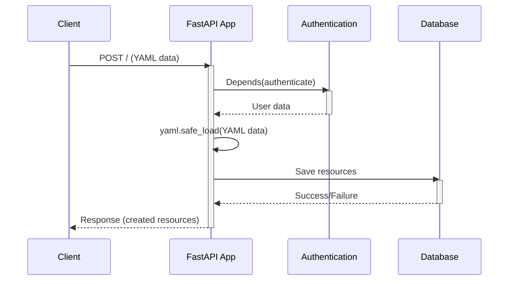

This diagram illustrates the data flow for creating resources from a YAML configuration. The client sends a POST request with YAML data, which is then authenticated. The application parses the YAML and saves the resources to the database, finally returning a response to the client.

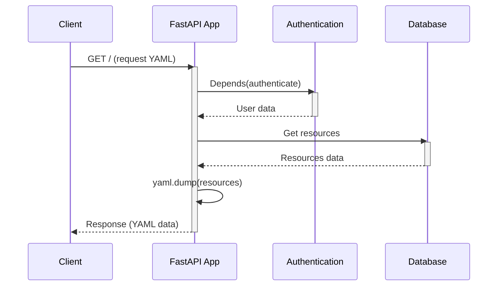

This diagram illustrates the data flow for retrieving resources as a YAML configuration. The client sends a GET request, which is then authenticated. The application fetches resources from the database, serializes it to YAML, and returns a response to the client.

Sources: [src/fyodorov_utils/services/yaml.py:33-95](), [src/fyodorov_utils/services/yaml.py:97-125](), [src/fyodorov_utils/auth/auth.py:14-27]()

## Configuration

The application uses environment variables for configuration, including the `JWT_SECRET`, `SUPABASE_URL`, and `SUPABASE_KEY`. These variables are loaded using `pydantic-settings` and `python-dotenv`. Sources: [src/fyodorov_utils/config/config.py:1-12]()

```python
from pydantic_settings import BaseSettings
import os
from dotenv import load_dotenv

load_dotenv()


class Settings(BaseSettings):
    JWT_SECRET: str = os.getenv("JWT_SECRET")
    SUPABASE_URL: str = os.getenv("SUPABASE_PROJECT_URL")
    SUPABASE_KEY: str = os.getenv("SUPABASE_API_KEY")
```
Sources: [src/fyodorov_utils/config/config.py:1-12]()

## Conclusion

The YAML parsing functionality in Fyodorov Utils provides a flexible way to manage resources through configuration files. The use of FastAPI, `PyYAML`, authentication, and error handling ensures that the YAML endpoints are secure, robust, and easy to use.


---

<a id='data-supabase'></a>

## Supabase Integration

<details>
<summary>Relevant source files</summary>

The following files were used as context for generating this wiki page:

- [src/fyodorov_utils/config/supabase.py](src/fyodorov_utils/config/supabase.py)
- [src/fyodorov_utils/services/base.py](src/fyodorov_utils/services/base.py)
- [src/fyodorov_utils/auth/auth.py](src/fyodorov_utils/auth/auth.py)
- [src/fyodorov_utils/services/tool.py](src/fyodorov_utils/services/tool.py)
- [src/fyodorov_utils/config/config.py](src/fyodorov_utils/config/config.py)
- [src/fyodorov_utils/auth/endpoints.py](src/fyodorov_utils/auth/endpoints.py)
</details>

# Supabase Integration

This page describes the Supabase integration within the `fyodorov-utils` library. Supabase is used as a backend service for authentication, data storage, and real-time updates. The `fyodorov-utils` library provides utilities for interacting with Supabase, including client initialization, authentication flows, and data access methods. This integration aims to simplify the interaction with Supabase services across various Fyodorov project components.

## Supabase Client Initialization

The `fyodorov-utils` library provides a utility function to initialize the Supabase client. This function, `get_supabase`, handles the creation of a Supabase client instance, optionally configured with a JWT for authentication. The client is initialized with the Supabase URL and API key retrieved from environment variables using the `Settings` class. [Link to Authentication](#authentication)

```python
from supabase import create_client, Client
from supabase.lib.client_options import ClientOptions
from .config import Settings

settings = Settings()


def get_supabase(jwt: str = None) -> Client:
    if jwt and jwt != "" and len(jwt.split(".")) == 3:
        return create_client(
            settings.SUPABASE_URL,
            settings.SUPABASE_KEY,
            options=ClientOptions(headers={"Authorization": f"Bearer {jwt}"}),
        )
    else:
        return create_client(settings.SUPABASE_URL, settings.SUPABASE_KEY)
```
Sources: [src/fyodorov_utils/config/supabase.py:1-19]()

### Configuration Settings

The Supabase URL and API key are configured using the `Settings` class, which reads environment variables. This configuration ensures that the Supabase client can connect to the correct Supabase project.

```python
from pydantic_settings import BaseSettings
import os
from dotenv import load_dotenv

load_dotenv()


class Settings(BaseSettings):
    JWT_SECRET: str = os.getenv("JWT_SECRET")
    SUPABASE_URL: str = os.getenv("SUPABASE_PROJECT_URL")
    SUPABASE_KEY: str = os.getenv("SUPABASE_API_KEY")
```
Sources: [src/fyodorov_utils/config/config.py:1-12]()

### Client Options

The `get_supabase` function allows passing a JWT for authentication. If a valid JWT is provided, it's included in the client options as an authorization header.

```python
options=ClientOptions(headers={"Authorization": f"Bearer {jwt}"})
```
Sources: [src/fyodorov_utils/config/supabase.py:12-15]()

## Authentication

The `fyodorov-utils` library provides authentication functionalities using Supabase. These include signing up, signing in, and creating API keys. The authentication process relies on JWTs for secure communication.

### Authentication Flow

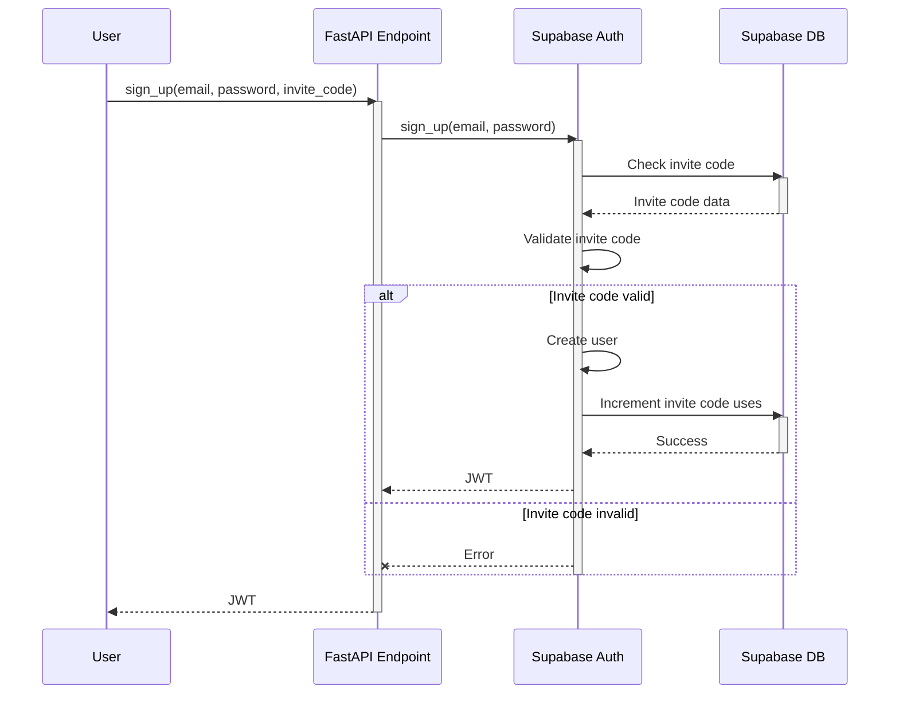

This diagram illustrates the user sign-up flow, including invite code validation and JWT issuance.

### Sign-up Endpoint

The `sign_up` function handles user registration. It validates an invite code, creates a new user in Supabase, and increments the invite code usage count.

```python
@error_handler
async def sign_up(
    email: str = Body(...), password: str = Body(...), invite_code: str = Body(...)
):
    # Check if invite code exists
    invite_code_check = (
        supabase.from_("invite_codes")
        .select("nr_uses, max_uses")
        .eq("code", invite_code)
        .execute()
    )
    if not invite_code_check.data:
        raise HTTPException(status_code=401, detail="Invalid invite code")

    invite_code_data = invite_code_check.data[0]
    nr_uses = invite_code_data["nr_uses"]
    max_uses = invite_code_data["max_uses"]

    if nr_uses >= max_uses:
        raise HTTPException(
            status_code=401, detail="Invite code has reached maximum usage"
        )

    user = supabase.auth.sign_up(
        {
            "email": email,
            "password": password,
            "options": {
                "data": {
                    "invite_code": invite_code,
                }
            },
        }
    )
    # Increment nr_uses in invite_codes table
    nr_uses += 1
    res = (
        supabase.from_("invite_codes")
        .update({"nr_uses": nr_uses})
        .eq("code", invite_code)
        .execute()
    )
    print(f"response when updating invite code nr uses: {res}")

    return {"message": "User created successfully", "jwt": user.session.access_token}
```
Sources: [src/fyodorov_utils/auth/auth.py:52-102]()

### Sign-in Endpoint

The `sign_in` function authenticates a user with their email and password. Upon successful authentication, it returns a JWT.

```python
@error_handler
async def sign_in(email: str = Body(...), password: str = Body(...)):
    try:
        user = supabase.auth.sign_in_with_password(
            {
                "email": email,
                "password": password,
            }
        )
    except gotrue.errors.AuthApiError as e:
        print(f"Error signing in - invalid credentials: {type(e)} {str(e)}")
        raise HTTPException(status_code=401, detail="Invalid credentials")
    except Exception as e:
        print(f"Error signing in: {type(e)} {str(e)}")
        raise HTTPException(status_code=401, detail="Error signing in")
    return {"message": "User signed in successfully", "jwt": user.session.access_token}
```
Sources: [src/fyodorov_utils/auth/auth.py:105-120]()

### API Key Creation

The `create_api_key` function generates a JWT that can be used as an API key. The expiration time for the API key can be specified.

```python
@error_handler
async def create_api_key(expiration: int = 15, user=Depends(authenticate)):
    print(f"[create_api_key] expiration: {expiration}")
    api_key = generate_jwt(user, expiration)
    return {"message": "API key created successfully", "api_key": api_key}
```
Sources: [src/fyodorov_utils/auth/auth.py:123-127]()

### JWT Generation

The `generate_jwt` function creates a JWT with user information and an expiration time. The JWT is signed using a secret key.

```python
def generate_jwt(user, days_to_expiry: int = 30) -> str:
    if days_to_expiry > 90 or days_to_expiry < 1:
        days_to_expiry = 30
    user["iat"] = datetime.utcnow()
    expiry = datetime.utcnow() + timedelta(days=days_to_expiry)
    print(f"Expiry: {expiry} \nNow: {datetime.utcnow()}")
    user["exp"] = expiry
    token = jwt.encode(user, settings.JWT_SECRET, algorithm="HS256")
    return token
```
Sources: [src/fyodorov_utils/auth/auth.py:130-141]()

### Authentication Dependency

The `authenticate` function is a dependency that verifies the JWT provided in the request headers. It decodes the JWT and returns the payload if the JWT is valid.

```python
async def authenticate(credentials: HTTPAuthorizationCredentials = Security(security)):
    try:
        payload = jwt.decode(
            credentials.credentials,
            settings.JWT_SECRET,
            algorithms=["HS256"],
            audience="authenticated",
        )
        # Perform additional validation checks as needed (e.g., expiration, issuer, audience)
        print(f"Decoded JWT payload: {payload}")
        return payload  # Or a user object based on the payload
    except jwt.PyJWTError as e:
        print(f"JWT error: {str(e)}")
        raise HTTPException(
            status_code=HTTP_403_FORBIDDEN, detail="Could not validate credentials"
        ) from e
```
Sources: [src/fyodorov_utils/auth/auth.py:148-164]()

### User Endpoints

The `users_app` FastAPI application defines the authentication endpoints. It includes routes for signing up, signing in, and creating API keys.

```python
from fastapi import FastAPI, Body, Depends
from .auth import sign_up, sign_in, create_api_key, authenticate

users_app = FastAPI(
    title="Fyodorov-Auth",
    description="Common auth endpoints for Fyodorov services",
    version="0.0.1",
)


@users_app.get("/")
async def root(user=Depends(authenticate)):
    print(f"[/users/] User: {user}")
    return {"message": "logged in"}


@users_app.post("/sign_up")
async def sign_up_endpoint(
    email: str = Body(...), password: str = Body(...), invite_code: str = Body(...)
):
    return await sign_up(email, password, invite_code)


@users_app.post("/sign_in")
async def sign_in_endpoint(email: str = Body(...), password: str = Body(...)):
    return await sign_in(email, password)


@users_app.post("/create_api_key")
async def create_api_key_endpoint(expiration: int = 15, user=Depends(authenticate)):
    return await create_api_key(expiration, user)
```
Sources: [src/fyodorov_utils/auth/endpoints.py:1-37]()

## Data Access

The `fyodorov-utils` library provides base classes and utility functions for interacting with Supabase tables. These utilities simplify the process of creating, updating, and retrieving data from Supabase.

### Base Model

The `Model` class serves as a base class for data models. It provides methods for converting model instances to dictionaries and vice versa.

```python
class Model:
    id: str = None

    def to_dict(self):
        return {c.name: str(getattr(self, c.name)) for c in self.__table__.columns}

    def from_dict(self, data):
        for field in self.__table__.columns:
            if field.name in data:
                setattr(self, field.name, data[field.name])
```
Sources: [src/fyodorov_utils/services/base.py:4-15]()

### Base Class

The `Base` class extends the `Model` class and provides methods for performing database operations on a specified table.

```python
class Base(Model):
    table: str = "ERROR: table not set"

    def create_in_db(self, access_token: str) -> str:
        try:
            supabase = get_supabase(access_token)
            result = supabase.table(self.table).insert(self.to_dict()).execute()
            self.id = result.data[0]["id"]
            return self.id
        except Exception as e:
            print("Error creating object in table", self.table, str(e))
            raise e

    def update_in_db(self, access_token: str, id: str) -> dict:
        if not id:
            raise ValueError("ID is required to update in table", self.table)
        try:
            self.id = id
            supabase = get_supabase(access_token)
            result = (
                supabase.table(self.table)
                .update(self.to_dict())
                .eq("id", self.id)
                .execute()
            )
            return result.data[0]
        except Exception as e:
            print(
                "Error updating object in table",
                self.table,
                id,
                str(e),
                self.to_dict(),
            )
            raise e
```
Sources: [src/fyodorov_utils/services/base.py:18-51]()

### Tool Data Access

The `Tool` class provides methods for managing tool data in the Supabase database. It includes functions for creating, updating, deleting, and retrieving tool records.

```python
class Tool(Base):
    def create_from_plugin(access_token: str, plugin: dict) -> ToolModel:
        print("in func creating tool from plugin")
        tool = ToolModel.from_plugin(plugin)
        print("created tool from plugin", tool)
        return Tool.create_in_db(access_token, tool)

    @staticmethod
    def create_in_db(access_token: str, tool: ToolModel) -> str:
        try:
            supabase = get_supabase(access_token)
            result = supabase.table("tools").insert(tool.to_dict()).execute()
            tool_id = result.data[0]["id"]
            return tool_id
        except Exception as e:
            print("Error creating tool", str(e))
            raise e

    @staticmethod
    def update_in_db(access_token: str, id: str, tool: dict) -> dict:
        if not id:
            raise ValueError("Tool ID is required")
        try:
            supabase = get_supabase(access_token)
            result = supabase.table("tools").update(tool).eq("id", id).execute()
            return result.data[0]
        except Exception as e:
            print("An error occurred while updating tool:", id, str(e))
            raise

    @staticmethod
    def delete_in_db(access_token: str, id: str) -> bool:
        if not id:
            raise ValueError("Tool ID is required")
        try:
            supabase = get_supabase(access_token)
            supabase.table("tools").delete().eq("id", id).execute()
            return True
        except Exception as e:
            print("Error deleting tool", str(e))
            raise e

    @staticmethod
    def get_in_db(access_token: str, id: str) -> ToolModel:
        if not id:
            raise ValueError("Tool ID is required")
        try:
            supabase = get_supabase(access_token)
            result = supabase.table("tools").select("*").eq("id", id).limit(1).execute()
            tool_dict = result.data[0]
            print("got tool from db", tool_dict)
            tool = ToolModel(**tool_dict)
            return tool
        except Exception as e:
            print("Error fetching tool", str(e))
            raise e

    @staticmethod
    def get_all_in_db(
        access_token: str, limit: int = 10, created_at_lt: datetime = datetime.now()
    ) -> [dict]:
        try:
            supabase = get_supabase(access_token)
            result = (
                supabase.from_("tools")
                .select("*")
                .limit(limit)
                .lt("created_at", created_at_lt)
                .order("created_at", desc=True)
                .execute()
            )
            tools = result.data
            return tools
        except Exception as e:
            print("Error fetching tools", str(e))
            raise e
```
Sources: [src/fyodorov_utils/services/tool.py:5-97]()

### Data Flow

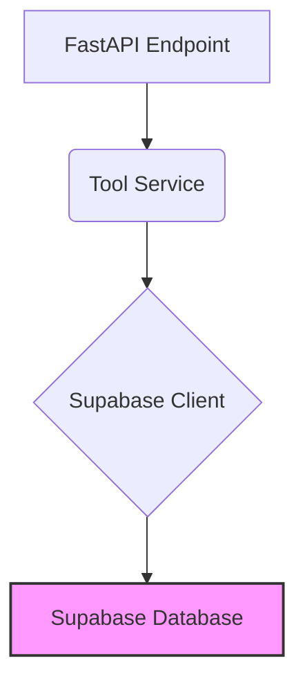

This diagram illustrates the data flow from a FastAPI endpoint to the Supabase database through the Tool service.

## Conclusion

The Supabase integration in `fyodorov-utils` provides a robust and streamlined way to interact with Supabase services. It encapsulates authentication, data access, and configuration management, simplifying the development of applications that rely on Supabase as a backend. The library's utilities and base classes promote code reuse and maintainability across the Fyodorov project.


---

<a id='backend-services'></a>

## Base Services

<details>
<summary>Relevant source files</summary>

The following files were used as context for generating this wiki page:

- [src/fyodorov_utils/services/base.py](src/fyodorov_utils/services/base.py)
- [src/fyodorov_utils/services/tool.py](src/fyodorov_utils/services/tool.py)
- [src/fyodorov_utils/config/supabase.py](src/fyodorov_utils/config/supabase.py)
- [src/fyodorov_utils/config/config.py](src/fyodorov_utils/config/config.py)
- [src/fyodorov_utils/auth/auth.py](src/fyodorov_utils/auth/auth.py)
- [src/fyodorov_utils/decorators/logging.py](src/fyodorov_utils/decorators/logging.py)
</details>

# Base Services

The `fyodorov_utils` library provides base services and utilities for interacting with a Supabase database, handling configurations, and managing authentication. The base service defines common functionalities for creating, updating, and retrieving data within the Fyodorov project. It leverages Supabase for database interactions and provides a consistent interface for other services to extend. [src/fyodorov_utils/services/base.py]()

This wiki page outlines the structure and functionality of the base service, including its core components, methods, and configurations. It also covers related aspects such as Supabase client initialization, configuration settings, and authentication mechanisms.

## Core Components

The base service includes the `Model` and `Base` classes, which provide foundational functionalities for interacting with database tables. [src/fyodorov_utils/services/base.py]()

### Model Class

The `Model` class serves as a base for data models, providing methods for converting model attributes to a dictionary. [src/fyodorov_utils/services/base.py]()

```python
class Model:
    id: str = None

    def to_dict(self):
        return {c.name: str(getattr(self, c.name)) for c in self.__table__.columns}

    def from_dict(self, data):
        for field in self.__table__.columns:
            if field.name in data:
                setattr(self, field.name, data[field.name])
```
Sources: [src/fyodorov_utils/services/base.py:4-13]()

The `to_dict` method converts the model's attributes into a dictionary, mapping column names to their corresponding values. [src/fyodorov_utils/services/base.py:7-8]() The `from_dict` method populates the model's attributes from a dictionary. [src/fyodorov_utils/services/base.py:10-13]()

### Base Class

The `Base` class extends the `Model` class and provides methods for performing CRUD (Create, Read, Update, Delete) operations on a specified database table. [src/fyodorov_utils/services/base.py]()

```python
class Base(Model):
    table: str = "ERROR: table not set"

    def create_in_db(self, access_token: str) -> str:
        try:
            supabase = get_supabase(access_token)
            result = supabase.table(self.table).insert(self.to_dict()).execute()
            self.id = result.data[0]["id"]
            return self.id
        except Exception as e:
            print("Error creating object in table", self.table, str(e))
            raise e

    def update_in_db(self, access_token: str, id: str) -> dict:
        if not id:
            raise ValueError("ID is required to update in table", self.table)
        try:
            self.id = id
            supabase = get_supabase(access_token)
            result = (
                supabase.table(self.table)
                .update(self.to_dict())
                .eq("id", self.id)
                .execute()
            )
            return result.data[0]
        except Exception as e:
            print("Error updating object in table", self.table, id, str(e))
            raise e

    def delete_in_db(self, access_token: str, id: str) -> bool:
        if not id:
            raise ValueError("ID is required to delete from table", self.table)
        try:
            supabase = get_supabase(access_token)
            result = supabase.table(self.table).delete().eq("id", id).execute()
            return True
        except Exception as e:
            print("Error deleting object in table", self.table, id, str(e))
            return False
```
Sources: [src/fyodorov_utils/services/base.py:16-59]()

Key methods include:

*   `create_in_db`: Creates a new record in the database table. [src/fyodorov_utils/services/base.py:20-26]()
*   `update_in_db`: Updates an existing record in the database table. [src/fyodorov_utils/services/base.py:28-42]()
*   `delete_in_db`: Deletes a record from the database table. [src/fyodorov_utils/services/base.py:44-54]()

These methods use the Supabase client to interact with the database, requiring an access token for authentication. [src/fyodorov_utils/services/base.py:22, 32, 47]()

## Supabase Integration

The base service relies on Supabase for database interactions. The `get_supabase` function initializes and returns a Supabase client. [src/fyodorov_utils/config/supabase.py]()

```python
from supabase import create_client, Client
from supabase.lib.client_options import ClientOptions
from .config import Settings

settings = Settings()


def get_supabase(jwt: str = None) -> Client:
    if jwt and jwt != "" and len(jwt.split(".")) == 3:
        return create_client(
            settings.SUPABASE_URL,
            settings.SUPABASE_KEY,
            options=ClientOptions(headers={"Authorization": f"Bearer {jwt}"}),
        )
    else:
        return create_client(settings.SUPABASE_URL, settings.SUPABASE_KEY)
```
Sources: [src/fyodorov_utils/config/supabase.py:1-17]()

The `get_supabase` function accepts an optional JWT (JSON Web Token) for authentication. If a valid JWT is provided, the client is initialized with the token in the `Authorization` header. Otherwise, the client is initialized without authentication. [src/fyodorov_utils/config/supabase.py:9-15]() The Supabase URL and API key are retrieved from the `Settings` class. [src/fyodorov_utils/config/supabase.py:4, 11, 15]()

## Configuration Settings

The `Settings` class, defined in `fyodorov_utils/config/config.py`, manages configuration settings using `pydantic-settings`. [src/fyodorov_utils/config/config.py]()

```python
from pydantic_settings import BaseSettings
import os
from dotenv import load_dotenv

load_dotenv()


class Settings(BaseSettings):
    JWT_SECRET: str = os.getenv("JWT_SECRET")
    SUPABASE_URL: str = os.getenv("SUPABASE_PROJECT_URL")
    SUPABASE_KEY: str = os.getenv("SUPABASE_API_KEY")
```
Sources: [src/fyodorov_utils/config/config.py:1-11]()

It loads environment variables using `dotenv` and provides attributes for accessing the JWT secret, Supabase URL, and Supabase API key. [src/fyodorov_utils/config/config.py:4, 8-10]()

## Authentication

Authentication is handled using JWTs. The `authenticate` function in `fyodorov_utils/auth/auth.py` validates the JWT provided in the `Authorization` header. [src/fyodorov_utils/auth/auth.py]()

```python
from fastapi import Depends, HTTPException, Security, Body
from fastapi.security import HTTPBearer, HTTPAuthorizationCredentials
import jwt
from starlette.status import HTTP_403_FORBIDDEN
import gotrue
from datetime import datetime, timedelta
from fyodorov_utils.decorators.logging import error_handler
from fyodorov_utils.config.config import Settings
from fyodorov_utils.config.supabase import get_supabase

settings = Settings()
security = HTTPBearer()
supabase = get_supabase()


async def authenticate(credentials: HTTPAuthorizationCredentials = Security(security)):
    try:
        payload = jwt.decode(
            credentials.credentials,
            settings.JWT_SECRET,
            algorithms=["HS256"],
            audience="authenticated",
        )
        # Perform additional validation checks as needed (e.g., expiration, issuer, audience)
        print(f"Decoded JWT payload: {payload}")
        return payload  # Or a user object based on the payload
    except jwt.PyJWTError as e:
        print(f"JWT error: {str(e)}")
        raise HTTPException(
            status_code=HTTP_403_FORBIDDEN, detail="Could not validate credentials"
        ) from e
```
Sources: [src/fyodorov_utils/auth/auth.py:1-33]()

The function decodes the JWT using the `JWT_SECRET` from the `Settings` class and returns the payload if the token is valid. [src/fyodorov_utils/auth/auth.py:22, 24, 28-31]() If the token is invalid, it raises an `HTTPException` with a 403 status code. [src/fyodorov_utils/auth/auth.py:32-33]()

## Error Handling

The `@error_handler` decorator in `fyodorov_utils/decorators/logging.py` provides a consistent way to handle and log errors in FastAPI endpoints. [src/fyodorov_utils/decorators/logging.py]() While the specific implementation details are not provided in the given files, its usage is demonstrated in `fyodorov_utils/auth/auth.py` and other files. [src/fyodorov_utils/auth/auth.py:7, 40, 54, 66]()

## Tool Service Example

The `Tool` service in `fyodorov_utils/services/tool.py` provides an example of how to extend the `Base` class to implement specific functionalities. [src/fyodorov_utils/services/tool.py]()

```python
from datetime import datetime
from fyodorov_utils.config.supabase import get_supabase
from fyodorov_llm_agents.tools.tool import Tool as ToolModel
from .base import Base


class Tool(Base):
    def create_from_plugin(access_token: str, plugin: dict) -> ToolModel:
        print("in func creating tool from plugin")
        tool = ToolModel.from_plugin(plugin)
        print("created tool from plugin", tool)
        return Tool.create_in_db(access_token, tool)

    @staticmethod
    def create_in_db(access_token: str, tool: ToolModel) -> str:
        try:
            supabase = get_supabase(access_token)
            result = supabase.table("tools").insert(tool.to_dict()).execute()
            tool_id = result.data[0]["id"]
            return tool_id
        except Exception as e:
            print("Error creating tool", str(e))
            raise e

    @staticmethod
    def update_in_db(access_token: str, id: str, tool: dict) -> dict:
        if not id:
            raise ValueError("Tool ID is required")
        try:
            supabase = get_supabase(access_token)
            result = supabase.table("tools").update(tool).eq("id", id).execute()
            return result.data[0]
        except Exception as e:
            print("An error occurred while updating tool:", id, str(e))
            raise

    @staticmethod
    def delete_in_db(access_token: str, id: str) -> bool:
        if not id:
            raise ValueError("Tool ID is required")
        try:
            supabase = get_supabase(access_token)
            result = supabase.table("tools").delete().eq("id", id).execute()
            return True
        except Exception as e:
            print("Error deleting tool", id, str(e))
            return False

    @staticmethod
    def get_all_in_db(
        access_token: str, limit: int = 100, created_at_lt: str = None
    ) -> list:
        try:
            supabase = get_supabase(access_token)
            result = (
                supabase.from_("tools")
                .select("*")
                .limit(limit)
                .lt("created_at", created_at_lt)
                .order("created_at", desc=True)
                .execute()
            )
            tools = result.data
            return tools
        except Exception as e:
            print("Error fetching tools", str(e))
            raise e
```
Sources: [src/fyodorov_utils/services/tool.py:1-72]()

The `Tool` class inherits from `Base` and overrides the `create_in_db`, `update_in_db`, and `delete_in_db` methods to provide tool-specific functionalities. [src/fyodorov_utils/services/tool.py:7, 16, 30, 44]() It also includes a `create_from_plugin` method for creating a tool from a plugin dictionary and a `get_all_in_db` method for retrieving all tools from the database. [src/fyodorov_utils/services/tool.py:8-12, 58-72]()

## Architecture Diagram

The following diagram illustrates the architecture of the base services and their interactions with Supabase and the configuration settings.

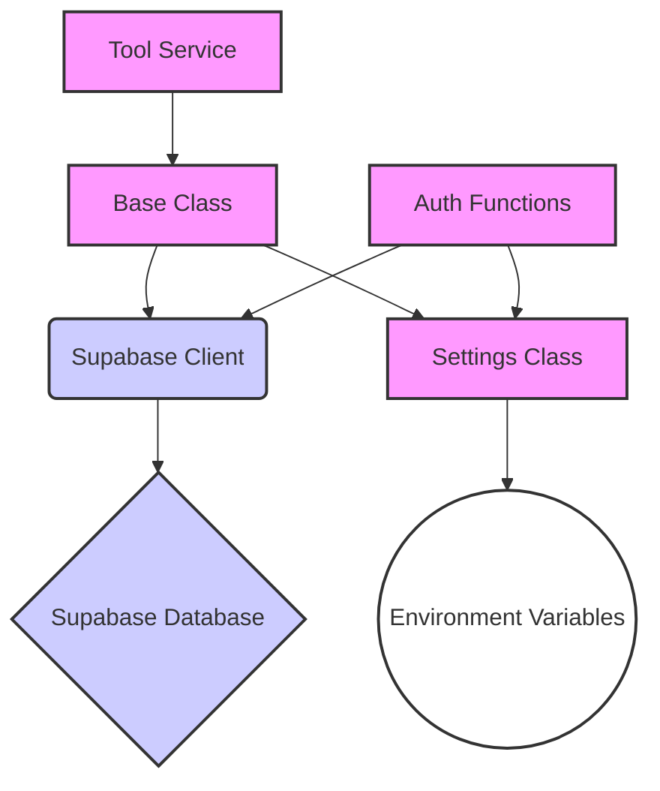

This diagram shows how the `Base` class interacts with the Supabase client to perform database operations, using settings from the `Settings` class. The `Tool` service extends the `Base` class, and authentication functions also rely on settings and the Supabase client. [src/fyodorov_utils/services/base.py](), [src/fyodorov_utils/config/supabase.py](), [src/fyodorov_utils/config/config.py](), [src/fyodorov_utils/services/tool.py](), [src/fyodorov_utils/auth/auth.py]()

## Summary

The base services in `fyodorov_utils` provide a foundation for building data-driven applications within the Fyodorov project. They offer a consistent interface for interacting with Supabase, managing configurations, and handling authentication. By extending the `Base` class and leveraging the provided utilities, developers can efficiently implement service-specific functionalities while adhering to established standards and practices.


---

<a id='backend-tools'></a>

## Tool Management

<details>
<summary>Relevant source files</summary>

The following files were used as context for generating this wiki page:

- [src/fyodorov_utils/services/tool.py](src/fyodorov_utils/services/tool.py)
- [src/fyodorov_llm_agents/tools/tool.py](src/fyodorov_llm_agents/tools/tool.py)
- [src/fyodorov_utils/config/supabase.py](src/fyodorov_utils/config/supabase.py)
- [src/fyodorov_utils/services/base.py](src/fyodorov_utils/services/base.py)
- [src/fyodorov_llm_agents/tools/mcp_tool_model.py](src/fyodorov_llm_agents/tools/mcp_tool_model.py)
- [src/fyodorov_llm_agents/tools/mcp_tool_service.py](src/fyodorov_llm_agents/tools/mcp_tool_service.py)
</details>

# Tool Management

Tool Management within the Fyodorov project involves creating, updating, retrieving, and deleting tools. These tools are stored in a database and are associated with user accounts. The `fyodorov_utils` library provides the necessary utilities and services to manage these tools effectively. This includes defining the data model for tools and implementing the API endpoints for interacting with the tool data.

## Tool Data Model

The `Tool` data model defines the structure of a tool within the system. It includes attributes such as the tool's name, description, and other relevant details. The `Tool` model is defined in `fyodorov_llm_agents`. Sources: [src/fyodorov_llm_agents/tools/tool.py](), [src/fyodorov_llm_agents/tools/mcp_tool_model.py]()

```python
# Example of Tool model attributes
# from fyodorov_llm_agents/tools/tool.py
class Tool(BaseModel):
    name: Optional[str] = None
    description: Optional[str] = None
    name_for_ai: Optional[str] = None
    description_for_ai: Optional[str] = None
    logo_url: Optional[str] = None
    api_url: Optional[str] = None
    plugin_url: Optional[str] = None
    contact_email: Optional[str] = None
    legal_info_url: Optional[str] = None
    # Addded
    user_id: Optional[str] = None
    id: Optional[str] = None
    created_at: Optional[datetime] = None
    updated_at: Optional[datetime] = None
    public: Optional[bool] = False
    tool_code:  Optional[str] = None
    verified: Optional[bool] = False
```

Sources: [src/fyodorov_llm_agents/tools/tool.py:5-23]()

### MCPTool Model

The `MCPTool` model extends the base `Tool` model and provides additional functionality, such as loading from YAML.

```python
# Example of MCPTool model attributes
# from fyodorov_llm_agents/tools/mcp_tool_model.py
class MCPTool(Tool):
    class Config:
        extra = "ignore"

    @classmethod
    def from_yaml(cls, yaml_string: str):
        data = yaml.safe_load(yaml_string)
        return cls(**data)

    def to_dict(self):
        return self.dict(by_alias=True)
```

Sources: [src/fyodorov_llm_agents/tools/mcp_tool_model.py:4-14]()

## Tool Service

The `Tool` service provides methods for interacting with the tool data in the database. This includes creating, updating, retrieving, and deleting tools. The service uses Supabase for database operations. Sources: [src/fyodorov_utils/services/tool.py](), [src/fyodorov_utils/config/supabase.py]()

### Key Functions

*   **`create_from_plugin(access_token: str, plugin: dict) -> ToolModel`**: Creates a tool from a plugin dictionary.  [src/fyodorov_utils/services/tool.py:5-8]()
*   **`create_in_db(access_token: str, tool: ToolModel) -> str`**: Inserts a new tool into the database. [src/fyodorov_utils/services/tool.py:11-16]()
*   **`update_in_db(access_token: str, id: str, tool: dict) -> dict`**: Updates an existing tool in the database. [src/fyodorov_utils/services/tool.py:19-24]()
*   **`delete_in_db(access_token: str, id: str) -> bool`**: Deletes a tool from the database. [src/fyodorov_utils/services/tool.py:27-32]()
*   **`get_in_db(access_token: str, id: str) -> ToolModel`**: Retrieves a tool from the database by its ID. [src/fyodorov_utils/services/tool.py:35-41]()
*   **`get_by_name_and_user_id(access_token: str, name: str, user_id: str) -> ToolModel`**: Retrieves a tool from the database by its name and user ID. [src/fyodorov_utils/services/tool.py:44-68]()
*   **`get_all_in_db(access_token: str, limit: int = 10, created_at_lt: datetime = datetime.now()) -> [dict]`**: Retrieves all tools from the database with optional limit and creation date filter. [src/fyodorov_utils/services/tool.py:71-82]()

### Database Interactions

The `Tool` service uses Supabase to interact with the database. The `get_supabase` function is used to obtain a Supabase client with the appropriate access token.

```python
# Example of getting Supabase client
# from fyodorov_utils/config/supabase.py
import os
from supabase import create_client, Client

def get_supabase(access_token: str = None) -> Client:
    supabase_url: str = os.environ.get("SUPABASE_URL")
    supabase_key: str = os.environ.get("SUPABASE_KEY")
    if access_token:
        return create_client(supabase_url, supabase_key, options={"global": {"headers": {"Authorization": f"Bearer {access_token}"}}})
    return create_client(supabase_url, supabase_key)
```

Sources: [src/fyodorov_utils/config/supabase.py:1-9]()

### Class Diagram

This diagram illustrates the relationship between the `Tool` service and the `ToolModel`.

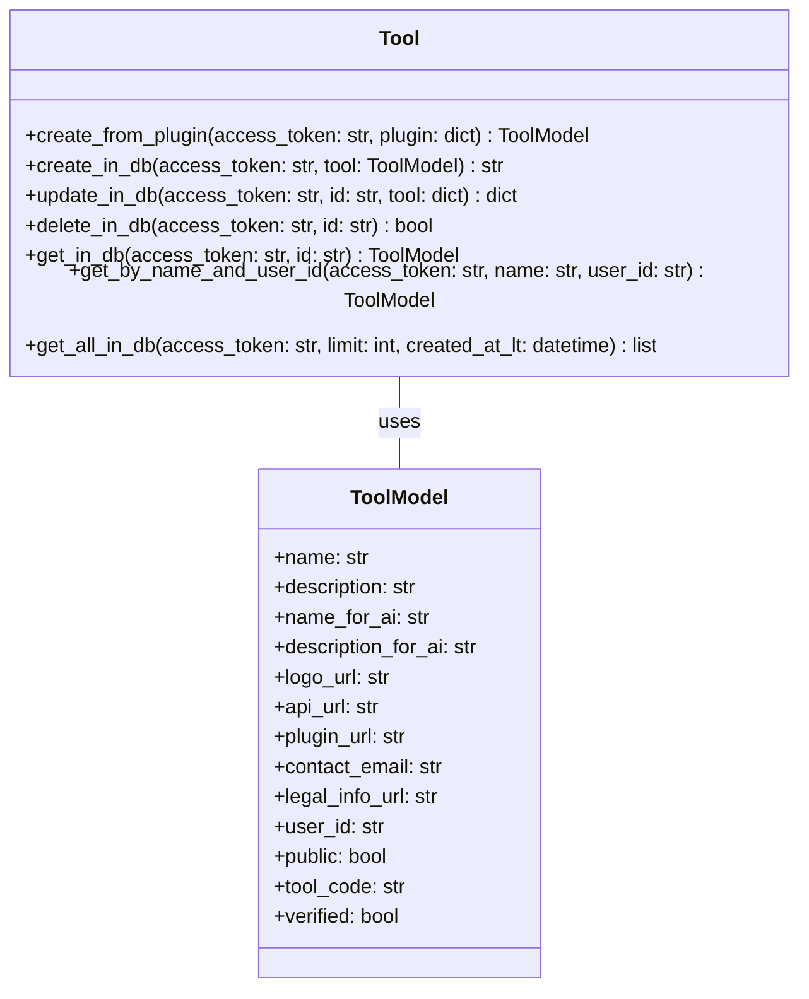

Sources: [src/fyodorov_utils/services/tool.py](), [src/fyodorov_llm_agents/tools/tool.py]()

### Base Class

The `Tool` class inherits from a `Base` class, which provides common functionality for interacting with the database. Sources: [src/fyodorov_utils/services/base.py]()

```python
# Example of Base class
# from fyodorov_utils/services/base.py
class Base:
    table: str = None
    base_object: object = None

    def __init__(self):
        if not self.table:
            raise ValueError("Please specify the supabase table name")
        if not self.base_object:
            raise ValueError("Please specify the base object")

    def from_dict(self, data: dict):
        for key, value in data.items():
            if hasattr(self.base_object, key):
                setattr(self.base_object, key, value)

    def get_in_db(self, access_token: str, id: str):
        if not id:
            raise ValueError("Tool ID is required")
        try:
            supabase = get_supabase(access_token)
            result = (
                supabase.from_(self.table)
                .select("*")
                .eq("id", id)
                .limit(1)
                .execute()
            )
            self.from_dict(result.data[0])
            return self.base_object
        except Exception as e:
            print("Error fetching tool", str(e))
            raise e

    def get_all_in_db(
        self,
        access_token: str,
        limit: int = 10,
        created_at_lt: datetime = datetime.now(),
    ) -> [dict]:
        try:
            supabase = get_supabase(access_token)
            result = (
                supabase.from_(self.table)
                .select("*")
                .limit(limit)
                .lt("created_at", created_at_lt)
                .order("created_at", desc=True)
                .execute()
            )
            tools = result.data
            return tools
        except Exception as e:
            print("Error fetching multiple objects from table", self.table, str(e))
            raise e
```

Sources: [src/fyodorov_utils/services/base.py:1-62]()

## MCPTool Service

The `MCPTool` service extends the base `Tool` service and provides additional functionality specific to MCP tools. Sources: [src/fyodorov_llm_agents/tools/mcp_tool_service.py]()

### Key Functions

*   **`create_or_update_in_db(session_id: str, tool: ToolModel, user_id: str) -> ToolModel`**: Creates a new tool or updates an existing tool in the database. [src/fyodorov_llm_agents/tools/mcp_tool_service.py:12-43]()

### Sequence Diagram

This diagram illustrates the process of creating or updating a tool in the database using the `MCPTool` service.

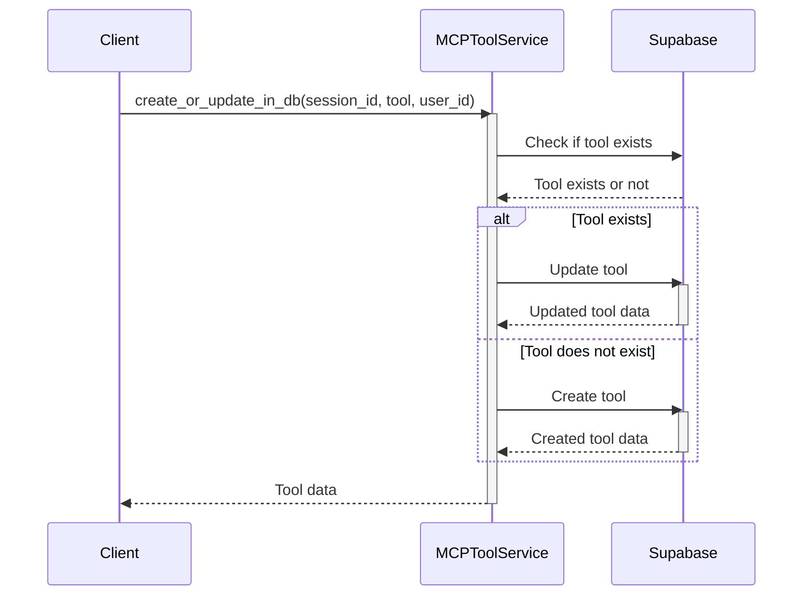

Sources: [src/fyodorov_llm_agents/tools/mcp_tool_service.py]()

## Conclusion

Tool Management is a crucial aspect of the Fyodorov project, providing the means to create, update, retrieve, and delete tools. The `fyodorov_utils` library offers the necessary services and utilities to manage these tools effectively, ensuring a seamless and efficient user experience.


---

<a id='deployment-guide'></a>

## Deployment Guide

<details>
<summary>Relevant source files</summary>

The following files were used as context for generating this wiki page:

- [README.md](README.md)
- [requirements.txt](requirements.txt)
- [src/fyodorov_utils/requirements.txt](src/fyodorov_utils/requirements.txt)
- [src/fyodorov_utils/decorators/logging.py](src/fyodorov_utils/decorators/logging.py)
- [src/fyodorov_utils/auth/auth.py](src/fyodorov_utils/auth/auth.py)
- [src/fyodorov_utils/auth/endpoints.py](src/fyodorov_utils/auth/endpoints.py)
</details>

# Deployment Guide

This document provides a guide to deploying and utilizing the `fyodorov-utils` library. `fyodorov-utils` is a Python library offering utility functions and classes for various services within the Fyodorov project, which comprises complementary services for working with LLM-based agents. The library standardizes practices and provides tooling for logging, error handling, authentication, and configuration management. `fyodorov-utils` aims to streamline development and ensure consistency across Fyodorov services. Sources: [README.md:5-14]()

## Installation

The `fyodorov_utils` library can be installed using pip. The recommended installation method is shown below.
```shell
pip install fyodorov-utils==0.2.11
```
Sources: [README.md:42-44]()

## Core Features

The `fyodorov-utils` library provides several key features that simplify the development of Fyodorov services. These features include error handling, authentication, and shared user endpoints.

### Error Handling

The library includes a decorator for handling errors in FastAPI endpoints. This decorator automatically logs errors in a consistent manner, reducing the amount of boilerplate code required for error handling. Sources: [README.md:16-20](), [src/fyodorov_utils/decorators/logging.py]()

```python
from fyodorov_utils.decorators.logging import error_handler

@app.post
@error_handler
def endpoint():
    return
```
Sources: [README.md:22-26]()

### Authentication

The `fyodorov-utils` library provides an authentication helper that simplifies the process of authenticating users via JWT. This helper can be used to protect FastAPI endpoints and make the user object available within the function. Sources: [README.md:28-31](), [src/fyodorov_utils/auth/auth.py]()

```python
from fyodorov_utils.auth.auth import authenticate

@app.post('/endpoint')
@error_handler
def create_provider(provider: ProviderModel, user = Depends(authenticate)):
    return
```
Sources: [README.md:33-37]()

This requires calls to that endpoint to be authenticated by the user's access token (which is a JWT). It also makes the user object available within the function for additional authentication or authorization logic. Sources: [README.md:37-39]()

### Shared User Endpoints

The library defines shared user endpoints for common user actions such as signing up, logging in, and creating API keys. These endpoints are defined in the library and can be used like this: Sources: [README.md:41-42](), [src/fyodorov_utils/auth/endpoints.py]()

```python
# User endpoints
from fyodorov_utils.auth.endpoints import users_app
app.mount('/users', users_app)
```
Sources: [README.md:46-49]()

## Authentication Flow

The following diagram illustrates the authentication flow using the `fyodorov_utils` library.

```mermaid
sequenceDiagram
    participant User
    participant FastAPI App
    participant authenticate()
    participant JWT
    
    User->>FastAPI App: Request to endpoint
    activate FastAPI App
    FastAPI App->>authenticate(): Depends(authenticate)
    activate authenticate()
    authenticate()->>JWT: Decode JWT
    alt JWT Valid
        authenticate()-->>FastAPI App: User data
        deactivate authenticate()
        FastAPI App-->>User: Response
    else JWT Invalid
        authenticate()--xFastAPI App: HTTPException
        deactivate authenticate()
        FastAPI App--xUser: 403 Forbidden
    end
    deactivate FastAPI App
```

The authentication process involves the `authenticate` function, which depends on the `HTTPBearer` security scheme to extract the JWT from the request's authorization header. The JWT is then decoded using the `JWT_SECRET` from the environment variables. If the JWT is valid, the decoded payload is returned; otherwise, an `HTTPException` with a 403 status code is raised. Sources: [src/fyodorov_utils/auth/auth.py:18-42](), [src/fyodorov_utils/config/config.py]()

## Error Handling Flow

The following diagram illustrates the error handling flow using the `fyodorov_utils` library's `error_handler` decorator.

```mermaid
sequenceDiagram
    participant Client
    participant FastAPI Endpoint
    participant error_handler
    participant Function
    
    Client->>FastAPI Endpoint: Request
    activate FastAPI Endpoint
    FastAPI Endpoint->>error_handler: Call endpoint function
    activate error_handler
    error_handler->>Function: Execute function
    alt Function executes successfully
        Function-->>error_handler: Return result
        deactivate error_handler
        FastAPI Endpoint-->>Client: Response
        deactivate FastAPI Endpoint
    else Function raises HTTPException
        Function--xerror_handler: HTTPException
        deactivate error_handler
        FastAPI Endpoint--xClient: HTTPException Response
        deactivate FastAPI Endpoint
    else Function raises Exception
        Function--xerror_handler: Exception
        error_handler->>FastAPI Endpoint: HTTPException (400)
        deactivate error_handler
        FastAPI Endpoint--xClient: HTTPException Response
        deactivate FastAPI Endpoint
    end
```
The `error_handler` decorator wraps FastAPI endpoint functions. If the function executes successfully, the decorator returns the result. If the function raises an `HTTPException`, the decorator re-raises it. If the function raises any other exception, the decorator catches it, logs the error, and raises a new `HTTPException` with a 400 status code. Sources: [src/fyodorov_utils/decorators/logging.py]()

## Dependencies

The `fyodorov-utils` library has the following dependencies, as specified in `src/fyodorov_utils/requirements.txt`:

| Dependency          | Version   |
| ------------------- | --------- |
| fastapi             | Any       |
| asyncio             | Any       |
| PyJWT               | Any       |
| starlette           | Any       |
| supabase            | Any       |
| pydantic            | \>=2.11.3 |
| fyodorov_llm_agents | ==0.4.61 |

Sources: [src/fyodorov_utils/requirements.txt]()

These dependencies must be installed in order to use the `fyodorov-utils` library. This is handled automatically when installing via pip.


---

